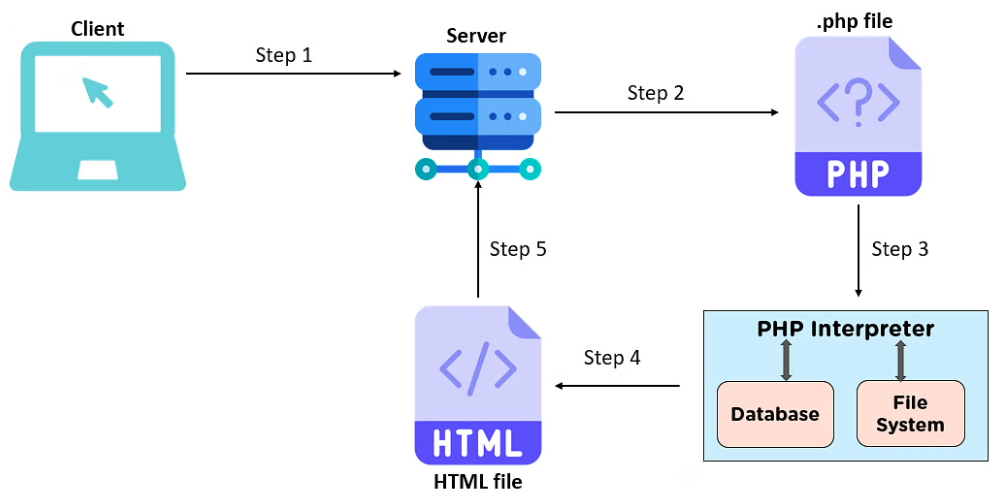

- Working principle
	- ภาษาสคริปต์ server-side ต่างกันไปตามภาษาที่ใช้ แต่หลักการทำงานทั่วไปคือการรับคำขอ, ประมวลผลคำขอ, สร้างหน้าเว็บหรือคำตอบและส่งกลับให้กับผู้ใช้ผ่านเบราว์เซอร์ ซึ่งช่วยให้เว็บแอปพลิเคชันสามารถทำงานแบบไดนามิกและปรับปรุงข้อมูลตามสถานการณ์และการกระทำของผู้ใช้ได้อย่างมีประสิทธิภาพและปลอดภัย.
- Workflow
	- ภาพแสดง Workflow จากตัวอย่างของ PHP สามารถสรุปเป็นขั้นตอนได้ดังนี้
	  
		- Step 1: Client ส่ง Request ไปยัง Server
		- Step 2: Server ทำการเรียก Script ที่ถูก Request
		- Step 3: Script ที่ถูก Request จะถูกส่งไป Process ที่ Interpreter
		- Step 4: ทำการสร้างเอกสาร HTML จาก Result ที่ได้จากการ Step 3
		- Step 5: ส่งเอกสาร HTML กลับไปยัง Server เพื่อส่ง Response ไปที่ Client
- Example of Server-Side Script Language
	- PHP Version ล่าสุดคือ 8 (ในหนังสือ 6)
		- มีลักษณะดังนี้
			- เป็น Open Source
			- เป็น Server-Side
			- multi platform
			- ประสิทธิภาพสูง
			- สนับสนุน OOP
			- เข้ากันได้กับ DB หลากหลาย
			- อ่านเขียน XML ได้
			- โครงสร้างภาษาง่าย สามารถ inline ลงใน HTML ได้
		- ตัวอย่างโค้ด PHP
		  ```php
		  <?php
		  // Connects ot your Database
		     mysql_connect("your.hostaddress.com", "username", "password") or die(mysql_error());
		     mysql_select_db("Database_Name") or die(mysql_error);
		     $data = mysql_query("SELECT * FROM friends WHERE pet='Cat'") or die(mysql_error());
		     print "<table border cellpadding=3>";
		     while($info = mysql_fetch_array($data))
		     {
		        print "<tr>";
		        print "<th>Name: </th> <td>".$info['name']."</td>";
		        print "<th>Color:</th> <td>".$info['fav_color']."</td>";
		        print "</tr>";
		     }   
		     print "</table>";
		  ?>
		  ```
	- ASP (ASP.NET)
		- หลักการทำงาน
			- โดยรวมเหมือน PHP
			- สามารถแยกประมวลผลของ Page เป็นส่วนๆ ได้ โดยไม่ต้องสร้าง เอกสาร HTML ใหม่ทั้งหน้า แต่แก้ไขเฉพาะส่วนที่มีการเปลี่ยนแปลงได้
		- องค์ประกอบของ **.Net Framework**
			- **.NET Framework Class Library (FCL)** เป็นชุดคลาสและคอมโพเนนต์ที่ใช้สำหรับพัฒนาแอปพลิเคชันบนแพลตฟอร์ม .NET Framework และ .NET Core (ตอนนี้เป็น .NET 5 และรุ่นใหม่กว่า). FCL เป็นส่วนสำคัญของ .NET Framework และให้ระบบขนาดใหญ่ของคลาสที่ใช้งานได้เพื่อช่วยในการพัฒนาแอปพลิเคชันในหลายด้าน ๆ รวมถึงการพัฒนาแอปพลิเคชัน Windows Forms และ ASP.NET อีกด้วย .NET Framework Class Library มีการแบ่งคลาสออกเป็นกลุ่มต่าง ๆ ดังนี้:
				- 1. **Windows Forms Classes**:
					- Windows Forms เป็นเฟรมเวิร์กที่ใช้สร้างแอปพลิเคชัน Windows Desktop โดยมี UI แบบแฟ้มฟอร์ม (Form) และส่วนควบคุม (Controls) เพื่อสร้างโปรแกรมกราฟิกอินเตอร์เฟซ (GUI) สำหรับผู้ใช้.
					- ใน FCL, คุณจะพบคลาสที่ใช้ในการสร้างและจัดการกับหน้าต่าง, ปุ่ม, เมนู, รายการ, ภาพ, และอื่น ๆ ที่เกี่ยวข้องกับการพัฒนาแอปพลิเคชัน Windows Forms.
				- 2. **ASP.NET Classes**:
					- ASP.NET เป็นเฟรมเวิร์กที่ใช้สร้างและจัดการกับเว็บแอปพลิเคชันที่ทำงานบนเซิร์ฟเวอร์ (Web Applications) โดยสร้างหน้าเว็บแบบไดนามิก (Dynamic Web Pages) และจัดการกับการโต้ตอบกับผู้ใช้ผ่าน HTTP.
					- ใน FCL, คุณจะพบคลาสที่ใช้ในการสร้างเว็บแอปพลิเคชัน ASP.NET รวมถึงคลาสที่เกี่ยวข้องกับการจัดการกับเซสชัน, การเข้ารหัส, การจัดการการร้องขอและการตอบกลับ, การเชื่อมต่อกับฐานข้อมูล, การสร้างหน้าเว็บ, และอื่น ๆ.
				- 3. **Other Classes**:
					- นอกเหนือจาก Windows Forms และ ASP.NET, FCL ยังรวมคลาสและคอมโพเนนต์อื่น ๆ ที่เกี่ยวข้องกับการพัฒนาแอปพลิเคชัน .NET ในทางกว้าง ๆ อันรวมถึงการจัดการไฟล์และโฟลเดอร์, การทำงานกับเครือข่าย, การประมวลผลข้อมูล, การจัดการการแสดงผล, การควบคุมการเข้าถึงสิทธิ์, การจัดการการเก็บข้อมูลแบบ XML, การควบคุมการประมวลผล, และหลายคอมโพเนนต์อื่น ๆ ที่มีความหลากหลาย.
			- **Common Language Runtime (CLR)** เป็นส่วนสำคัญใน .NET Framework และ .NET Core (ใน .NET 5 และรุ่นใหม่กว่า) ที่มีหน้าที่จัดการกับการประมวลผลและการทำงานของโปรแกรมที่ถูกพัฒนาด้วยภาษาที่รองรับ .NET โดยรวม นี่คือคุณสมบัติสำคัญของ CLR:
				- 1. **Memory Management (การจัดการหน่วยความจำ)**:
					- CLR รับผิดชอบในการจัดการหน่วยความจำ (Memory Management) โดยอัตโนมัติ และมี Garbage Collector (GC) ที่ตรวจสอบและลบอ็อบเจ็กต์ที่ไม่ได้ใช้งานออกจากหน่วยความจำ เพื่อลดความเสี่ยงในการเกิดความยุ่งเหยิงและความหนายน่าจะเกิดขึ้นจากการรั่วไหลหน่วยความจำ (Memory Leaks).
				- 2. **Common Type System (CTS)**:
					- CTS เป็นกฎระเบียบที่นิยมใช้สำหรับการกำหนดโครงสร้างของข้อมูลและการสร้างคลาสใน .NET Framework. สิ่งนี้ช่วยให้ .NET ภาษาต่าง ๆ สามารถทำงานร่วมกันได้อย่างมีประสิทธิภาพโดยไม่มีปัญหาในการแปลงข้อมูลระหว่างภาษา.
				- 3. **Intermediate Language (IL)**:
					- IL เป็นภาษาระหว่าง (Intermediate Language) ที่ถูกคอมไพล์จากโค้ดต้นฉบับของโปรแกรมที่ถูกพัฒนาด้วย .NET ภาษาต่าง ๆ เช่น C#, VB.NET, F# และอื่น ๆ.
					- โปรแกรม .NET จะถูกคอมไพล์เป็น IL ก่อนที่จะถูกโหลดและรันบน CLR บนเซิร์ฟเวอร์หรือคอมพิวเตอร์เป้าหมาย.
					- การใช้ IL ช่วยในการทำให้โปรแกรม .NET สามารถรันบนแพลตฟอร์มที่แตกต่างกันได้ (cross-platform) โดยไม่ต้องคอมไพล์ใหม่สำหรับแต่ละแพลตฟอร์ม.
		- ความสามารถของภาษา ASP.NET
			- 1) นําเอาเทคโนโลยีดอตเน็ตเฟรมเวิร์กมาใช้
			  id:: 659aa288-d48e-4b2e-b4e9-ecd5f15f4cd0
			- 2) เว็บเพจที่พัฒนาอยู่ในรูปเว็บฟอร์ม
			- 3) สามารถใช้ร่วมกับเบราว์เซอร์ได้ทุกประเภท
			- 4) แยกส่วนของโปรแกรมและคําสั่งที่ใช้สร้างจอภาพออกจากกัน
			- 5) มีความยืดหยุ่นในการเขียนโปรแกรมมากขึ้นโดยสามารถเลือกใช้ภาษาใดในการเขียนสคริปต์ก็ได้เช่น `C#` `VB.NET` และ `Jscript` เป็นต้น
			- 6) มีไลบรารี (library) ต่างๆให้เลือกใช้งานได้มากขึ้นสามารถเขียนโปรแกรมได้อย่างสะดวกมากขึ้น
			- 7) ดอตเน็ตเฟรมเวิร์ก