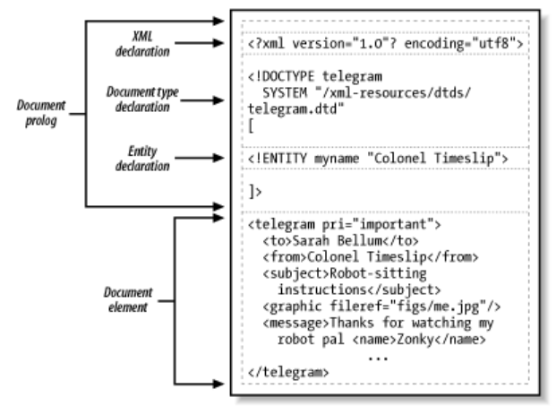
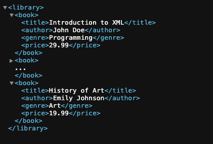
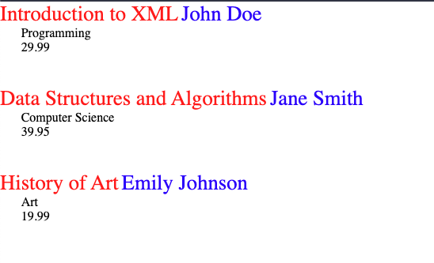

- Creating XML document
	- สามารถสร้างได้โดย Text Editor ทั่วไป โดย save ไฟล์เป็น `.xml`
- XML Structure
	- โครงสร้างมี 2 ส่วน
	  {:height 461, :width 621}
		- Document Prolog
		- Document Element
	- `comment` สามารถวางตรงไหนในเอกสารก็ได้ เพราะไม่ถูกนำไป process หรือแสดงผล การเขียน `comment` จะเขียนในไว้ระหว่าง `<!--` และ `-->` เช่น
		- ```
		  <!-- This is comment line -->
		  ```
	-
- Displaying XML Document
	- สามารถแสดงผลได้ 2 แบบ
		- แบบที่ไม่มี Style Sheet
		  
			- ในหนังสือใช้ Internet Explorer เครื่องหมาย Expand จะเป็น `+` Shrink จะเป็น `-`
			- ใน Browser ยุคใหม่จะเป็น เครื่องหมาย Expand ▶ Shrink จะเป็น ▼
		- แบบที่มี Style Sheet
			- file XML จะทำการแนบ reference ไปยังไฟล์ CSS `<?xml-stylesheet type="text/css" href="stylesheet.css"?>`
			  ```xml
			  <?xml version="1.0" encoding="UTF-8"?>
			  <?xml-stylesheet type="text/css" href="stylesheet.css"?>
			  <library>
			    <book>
			      <title>Introduction to XML</title>
			      <author>John Doe</author>
			      <genre>Programming</genre>
			      <price>29.99</price>
			    </book>
			    <book>
			      <title>Data Structures and Algorithms</title>
			      <author>Jane Smith</author>
			      <genre>Computer Science</genre>
			      <price>39.95</price>
			    </book>
			    <book>
			      <title>History of Art</title>
			      <author>Emily Johnson</author>
			      <genre>Art</genre>
			      <price>19.99</price>
			    </book>
			  </library>
			  ```
			- file CSS
			  ```css
			  /* Style for the table */
			  library {
			  	border-collapse: #ffffff;
			  	width: 100%;
			  }
			  book {
			  	display: block;
			  	margin-bottom: 30pt;
			  	margin-left: 0;
			  }
			  title {
			  	color: #ff0000;
			  	font-size: 20pt;
			  }
			  author {
			  	color: #0000ff;
			  	font-size: 20pt;
			  }
			  genre, price {
			  	display: block;
			  	color: #000000;
			  	margin-left: 20pt;
			  }
			  ```
			- ผลลัพท์
			  {:height 341, :width 548}