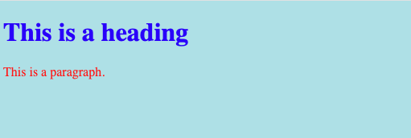

- Creating Style Sheet
	- Internal Document
		- ตัวอย่าง
		  ```html
		  <!DOCTYPE html>
		  <html>
		    <head>
		      <style>
		        body {background-color: powderblue;}
		        h1   {color: blue;}
		        p    {color: red;}
		      </style>
		    </head>
		    <body>
		  
		    <h1>This is a heading</h1>
		    <p>This is a paragraph.</p>
		  
		    </body>
		  </html>
		  ```
		  ผลลัพท์
		  
	- External Document
		- ตัวอย่าง 
		  HTML ใช้ `<link rel="stylesheet" href="styles.css">` เพื่อระบุที่เก็บไฟล์ CSS
		  ```html
		  <!DOCTYPE html>
		  <html>
		  <head>
		    <link rel="stylesheet" href="styles.css">
		  </head>
		  <body>
		  
		  <h1>This is a heading</h1>
		  <p>This is a paragraph.</p>
		  
		  </body>
		  </html>
		  ```
		  styles.css
		  ```css
		  body {
		    background-color: powderblue;
		  }
		  h1 {
		    color: blue;
		  }
		  p {
		    color: red;
		  }
		  ```
		  ผลลัพท์
		  
-