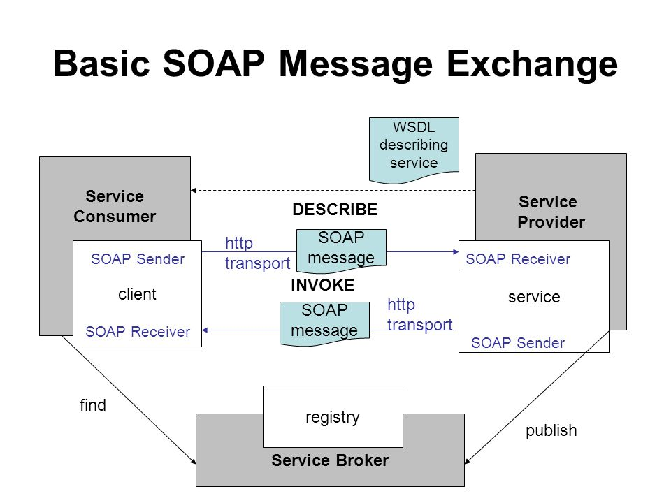
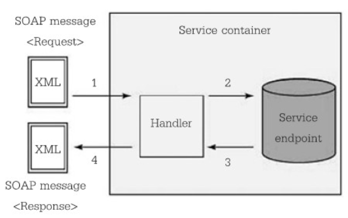
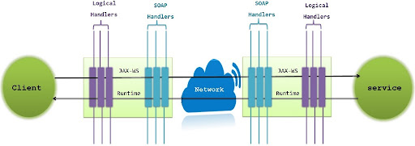

- SOAP (Simple Object Access Protocol) เป็นโปรโตคอลมาตรฐานที่ใช้สำหรับการแลกเปลี่ยนข้อมูลในรูปแบบของข้อความ XML ผ่านเครือข่ายอินเทอร์เน็ต มีความเป็นมาและบทบาทดังนี้:
- ### History
	- - **พัฒนาขึ้นโดย Microsoft:** SOAP ถูกพัฒนาครั้งแรกโดย Microsoft ในช่วงปลายทศวรรษ 1990 เพื่อเป็นวิธีการใหม่ในการทำให้แอพพลิเคชันต่างๆ สื่อสารกันผ่านเครือข่าย
	- - **มาตรฐานและสเปค:** ต่อมาได้รับการพัฒนาเป็นมาตรฐานที่กว้างขึ้นโดยองค์กรมาตรฐานเช่น W3C ที่ช่วยกำหนดสเปคของ SOAP ให้เป็นที่ยอมรับในวงกว้าง
	- - **รุ่นต่างๆ:** มีหลายเวอร์ชันของ SOAP ที่ถูกปล่อยออกมา, โดยที่ SOAP 1.2 เป็นรุ่นที่ได้รับการยอมรับและใช้งานกันอย่างแพร่หลาย
- ### Meaning of SOAP
	- ย่อมาจาก "Simple Object Access Protocol" ซึ่งเป็นโปรโตคอลมาตรฐานสำหรับการแลกเปลี่ยนข้อมูลโครงสร้างในรูปแบบของข้อความ XML ผ่านเครือข่ายอินเทอร์เน็ต, โดยเฉพาะผ่าน HTTP. มันออกแบบมาเพื่อให้โปรแกรมคอมพิวเตอร์ที่เขียนบนภาษาและแพลตฟอร์มต่างๆ สามารถสื่อสารกันได้. นี่คือคุณสมบัติหลักของ SOAP:
	- **ข้อความแบบ XML:** SOAP ใช้ XML เพื่อระบุและกำหนดรูปแบบของข้อมูลที่จะส่งผ่านเครือข่าย.
	- **รองรับโปรโตคอลที่หลากหลาย:** แม้ว่ามันมักจะใช้ร่วมกับ HTTP, SOAP ยังสามารถทำงานร่วมกับโปรโตคอลอื่นๆ ได้อีกด้วย, เช่น SMTP.
	- **ความอิสระทางแพลตฟอร์มและภาษา:** SOAP สามารถใช้งานได้กับภาษาการเขียนโปรแกรมและแพลตฟอร์มต่างๆ ทำให้สามารถแลกเปลี่ยนข้อมูลระหว่างระบบที่หลากหลาย.
	- **รองรับความปลอดภัย:** SOAP มีความสามารถในการรวมกับมาตรการความปลอดภัยต่างๆ เช่น WS-Security, ทำให้เหมาะสำหรับการแลกเปลี่ยนข้อมูลที่มีความสำคัญและความลับ.
	- **การรองรับเว็บเซอร์วิส:** SOAP เป็นเทคโนโลยีพื้นฐานในการสร้างเว็บเซอร์วิส, ซึ่งเป็นวิธีการที่นิยมในการเปิดใช้งานฟังก์ชันหรือบริการผ่านเครือข่าย.
- ### SOAP Messaging
	- **SOAP Request-Response**
	  
		- การสร้างคำขอ SOAP
			- **สร้างข้อความ XML:** ขั้นตอนแรกคือการสร้างข้อความ XML ที่ตรงตามมาตรฐานของ SOAP. ข้อความนี้ประกอบด้วยส่วน 'Envelope', ซึ่งเป็นภาชนะหลัก, และอาจมีส่วน 'Header' และ 'Body'.
				- **Header (ไม่จำเป็น):** อาจประกอบด้วยข้อมูลเช่น การรับรองความถูกต้อง, การเข้ารหัส, หรือข้อมูลตั้งค่าอื่นๆ.
				- **Body (จำเป็น):** มีข้อมูลที่จำเป็นสำหรับการเรียกใช้งานบริการ, ตัวอย่างเช่น, พารามิเตอร์ของเมธอดที่จะถูกเรียก.
		- การส่งคำขอ
			- **ผ่าน HTTP (หรือโปรโตคอลอื่นๆ):** ข้อความ SOAP จะถูกส่งไปยังเว็บเซอร์วิสผ่าน HTTP (ซึ่งเป็นวิธีที่พบบ่อยที่สุด) หรือโปรโตคอลอื่นๆ.
			- **อาจมีการรับรองความถูกต้อง:** การสื่อสารอาจรวมถึงการยืนยันตัวตนและ/หรือการเข้ารหัสข้อมูล.
		- การประมวลผลที่เซิร์ฟเวอร์
			- **การแยกและประมวลผลข้อมูล:** เซิร์ฟเวอร์ที่รับข้อความ SOAP จะแยกข้อมูลในส่วน 'Body' และประมวลผลตามคำขอที่ได้รับ.
			- **การจัดการข้อผิดพลาด:** หากมีข้อผิดพลาดในขณะประมวลผล, จะมีการสร้างข้อความข้อผิดพลาดในรูปแบบ SOAP และส่งกลับไปยังผู้ร้องขอ.
		- การส่งคำตอบ
			- **สร้างข้อความคำตอบ SOAP:** เซิร์ฟเวอร์สร้างข้อความคำตอบในรูปแบบ SOAP, ซึ่งประกอบด้วยผลลัพธ์หรือข้อมูลตอบกลับจากการประมวลผล.
			- **ส่งกลับไปยังไคลเอนต์:** ข้อความคำตอบจะถูกส่งกลับไปยังไคลเอนต์ที่ทำการร้องขอผ่านช่องทางเดียวกับที่ได้รับคำขอมา.
		- การประมวลผลคำตอบที่ไคลเอนต์
			- **แยกข้อมูลและประมวลผล:** ไคลเอนต์ที่รับข้อความคำตอบจะแยกและประมวลผลข้อมูลที่ได้รับ, อาจเป็นการแสดงผลลัพธ์, การปรับปรุงข้อมูลในระบบ, หรือการดำเนินการต่อเนื่องอื่นๆ.
		- Using Handler: การใช้งาน Handler ในกระบวนการของ Request-Response ในบริบทของ SOAP (Simple Object Access Protocol) เป็นวิธีการที่มีประสิทธิภาพในการจัดการและประมวลผลข้อมูลที่ส่งผ่านเครือข่าย. ในกระบวนการนี้, Handler ทำหน้าที่เป็นตัวกลางที่จัดการข้อมูลที่เข้ามา (request) และข้อมูลที่ส่งออก (response).
			- Request Handler
				- **ประมวลผลคำขอเข้า:** เมื่อมีคำขอ (request) ที่เข้ามา, คำขอนี้จะถูกส่งผ่าน Handler หนึ่งหรือหลายตัวที่จัดการกับแง่มุมต่างๆ ของข้อความ SOAP.
				- **การจัดการต่างๆ:** ตัวอย่างของการจัดการที่ Handler อาจทำได้แก่ การยืนยันตัวตน, การตรวจสอบสิทธิ์, การเข้ารหัส, หรือการบันทึกข้อมูล (logging).
				- **ส่งต่อข้อมูล:** หลังจาก Handler ประมวลผลคำขอเสร็จสิ้น, ข้อมูลจะถูกส่งต่อไปยังส่วนที่ประมวลผลต่อไป, ซึ่งอาจเป็นเซิร์ฟเวอร์เว็บเซอร์วิส.
			- Web Service Processing
				- **ประมวลผลข้อความ SOAP:** เซิร์ฟเวอร์เว็บเซอร์วิสจะประมวลผลข้อมูลที่ได้รับจากคำขอ.
				- **สร้างคำตอบ:** หลังจากประมวลผลเสร็จสิ้น, เซิร์ฟเวอร์จะสร้างคำตอบ (response) ในรูปแบบของข้อความ SOAP.
			- Response Handler
				- **ประมวลผลคำตอบออก:** ข้อความคำตอบจะถูกส่งผ่าน Handler ซึ่งจะจัดการกับการแปลงข้อมูล, การเพิ่มเติมข้อมูล, หรือการทำงานอื่นๆ ที่จำเป็นก่อนที่จะส่งข้อความคำตอบกลับไปยังไคลเอนต์.
				- **การตรวจสอบและประมวลผลส่วนที่เหลือ:** Handler อาจทำการตรวจสอบเพิ่มเติม, การประมวลผลข้อมูลที่เฉพาะเจาะจง, หรือการตั้งค่าค่าต่างๆ ที่จำเป็นสำหรับคำตอบ.
			- การทำงานร่วมกันของ Handler
				- Handler ทำหน้าที่เป็นส่วนประกอบที่สำคัญในกระบวนการของการรับและส่งข้อความ SOAP.
				- พวกมันช่วยให้สามารถแยกส่วนการจัดการและประมวลผลที่เฉพาะเจาะจงออกจากโค้ดหลักของเว็บเซอร์วิส, ทำให้การพัฒนาและการบำรุงรักษาง่ายขึ้น.
				- นอกจากนี้, การใช้ Handler ยังช่วยเพิ่มความปลอดภัยและความน่าเชื่อถือของกระบวนการสื่อสารผ่าน SOAP.
	- Handler Life Cycle
		- SOAP Handler มี Life-Cycle หรือวงจรชีวิตของการทำงานที่เฉพาะเจาะจงซึ่งกำหนดการทำงานและการจัดการข้อมูลในกระบวนการสื่อสารของ SOAP. วงจรชีวิตนี้ช่วยในการรักษาการทำงานที่มีประสิทธิภาพและการจัดการข้อมูลที่เหมาะสมในแต่ละขั้นตอน. นี่คือภาพรวมของวงจรชีวิตของ SOAP Handler:
		  
			- 1. การสร้าง (Instantiation)
				- **Handler Instance ถูกสร้างขึ้น:** ในขั้นตอนแรก, อินสแตนซ์ของ Handler จะถูกสร้างขึ้น. การสร้างนี้มักเกิดขึ้นเมื่อเว็บเซอร์วิสเริ่มต้นการทำงานหรือเมื่อมีคำขอเข้ามา.
				- การกำหนดค่า (Configuration) กำหนดค่าตัวแปรและรูปแบบ: Handler อาจต้องการการกำหนดค่าเฉพาะ, ซึ่งอาจรวมถึงการตั้งค่าตัวแปร, ทรัพยากร, หรือการกำหนดค่าอื่นๆ ที่เกี่ยวข้องกับการทำงาน.
			- 2. การประมวลผลคำขอ (Request Processing)
				- **การจัดการข้อความ SOAP:** เมื่อมีข้อความ SOAP เข้ามา, Handler จะทำหน้าที่ประมวลผลข้อมูลในข้อความนั้น. อาจรวมถึงการตรวจสอบ, การแปลงข้อมูล, หรือการประมวลผลอื่นๆ.
			- 3. การประมวลผลคำตอบ (Response Processing)
				- จัดการข้อมูลคำตอบ: หลังจากเซิร์ฟเวอร์ประมวลผลคำขอเสร็จสิ้น, Handler จะมีส่วนในการประมวลผลข้อมูลของคำตอบ (response) ที่จะส่งกลับไปยังไคลเอนต์. กระบวนการนี้อาจรวมถึงการเพิ่มข้อมูล, การแปลงรูปแบบข้อมูล, หรือการดำเนินการต่างๆ ที่จำเป็นสำหรับการสร้างข้อความ SOAP ของคำตอบ.
				- การจัดการข้อผิดพลาด (Error Handling) จัดการกับข้อผิดพลาด: ในกรณีที่เกิดข้อผิดพลาดระหว่างการประมวลผลข้อความ SOAP (ทั้งในส่วนของคำขอหรือคำตอบ), Handler จะมีบทบาทในการจัดการข้อผิดพลาดนั้น, ซึ่งอาจรวมถึงการบันทึกข้อผิดพลาด, การสร้างข้อความแจ้งเตือน, หรือการดำเนินการอื่นๆ เพื่อแก้ไขหรือรายงานปัญหา.
				- การทำความสะอาด (Clean-up): หลังจากการประมวลผลคำขอและคำตอบเสร็จสิ้น, อาจมีขั้นตอนการทำความสะอาดที่จำเป็น, เช่นการปลดแอกทรัพยากรที่ถูกจัดสรร, การปิดการเชื่อมต่อ, หรือการล้างตัวแปรที่ใช้งาน.
			- 4. การทำลาย (Destruction)
				- **การทำลายอินสแตนซ์:** เมื่อ Handler ไม่จำเป็นอีกต่อไป, อินสแตนซ์ของมันจะถูกทำลาย. การทำลายนี้หมายถึงการปลดปล่อยทรัพยากรที่ Handler ใช้งาน, ซึ่งเป็นส่วนสำคัญในการจัดการหน่วยความจำและทรัพยากรระบบ.
		- Handler สามารถอยู่ได้ทั้งฝั่ง Request และ Restponse ดังภาพ
		  
- SOAP Pros and Cons
	- Pros
		- **รูปแบบการทำงานของ SOAP เป็นที่ยอมรับ** ในภาษาโปรแกรมสมัยใหม่
		- **ไม่ต้องปรับเปลี่ยนรูปแบบโปรแกรมการทำงาน**
		- **รองรับการทำงานของ Platform ที่มีความแตกต่างกัน** เพราะ XML ส่งข้อมูลเป็น text ทำให้ Application ต่างๆ สามารถตีความข้อมูลได้ง่าย
		- **ทำงานได้ดีบนเครือข่ายที่มี Firewall** (ในหนังสือใช้ **การทำงานของ SOAP ไม่ขึ้นกับไฟร์วอล (firewall)**) เนื่องจาก SOAP จะถูกส่งโดย HTTP/HTTPS ซึ่งเป็น Application Layer Protocol ซี่งทำงานได้ดีบน Network ที่มี Firewall (ในหนังสือ ใช้คำว่าทะลุผ่าน Firewall ซึ่งเป็นการตีความที่ผิดไปจาก context ของการใช้งาน)
		- **การส่งผ่านข้อมูลในปริมาณมากได้**
		- มีความปลอดภัยในการส่งข้อมูล เพราะ SOAP เป็น message protocol ที่สามารถส่งผ่าน Application Layer Protocol ที่มีความปลอดภัยอย่าง HTTPS ได้
	- Cons
		- **ไม่สามารถส่งข้อมูลได้ทันที** การส่งข้อมูลต้องทำโดยการสร้าง SOAP Packet (request + message) ต้องมีการ acknowledge request ก่อนที่ service จะสามารถถอด message ออกมา process ได้ ซึ่งเป็นส่วนที่ developer จะต้องเขียนเพิ่มขึ้นเอง
		- **ใช้ memory เยอะ** เนื่องจาก XML Document มีการบรรจุ DTD และ Schema เอาไว้ ทำให้ใช้เวลาในการประมวลผลนานและมี Overhead สูง
		- **ความผิดพลาดของเอกสารบน SOAP** SOAP ไม่มีการตรวจสอบข้อมูลบนเอกสาร อาจจะเกิดความผิดพลาดระหว่างทำงาน ซึ่งจะสามารถตรวจพบได้แค่ในระดับ runtime เท่านั้น
		- **ทำการตกลงระหว่างองค์กร** แต่ละองค์กรที่มีมาตรฐานต่างกันต้องทำความตกลงร่วมกันบนมาตรฐาน XML ก่อนเพื่อไม่ให้เกิดข้อผิดพลาดในการทำงาน