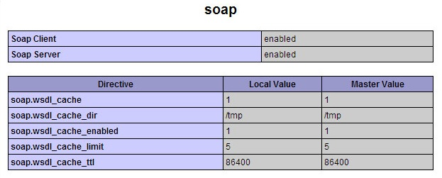

- Web Services developing processes (ขั้นตอนการพัฒนา Web Service **ในแบบฝึกหัดเรียก หลักการในการพัฒนา Web Services**)
	- ผู้พัฒนาสร้าง Web Service สำหรับให้บริการ (Implementation or create web services)
	- ผู้พัฒนาทำการติดตั้ง Web Services (Deploy Web Services)
	- ผู้พัฒนาทำการลงทะเบียน Web Services เพื่อเปิดใช้บริการ (UDDI Registry)
	- ผู้ใช้งานทำการสืบค้นเพื่อหาบริการต่างๆ ที่ต้องการได้จาก UDDI (Finding Web Services and Consume Web Services) ในกรณีนี้อาจะเสียงค่าบริการได้
- Application on Web Services developing processes (ขั้นตอนการพัฒนา Application บน Web Services)
	- การติดตั้ง SOAP Extension (ในหนังสือเป็นตัวอย่างจาก PHP5)
		- ใน Windows
			- แก้ไขไฟล์ `php.ini`
				- เปิดไฟล์แล้วค้นหาบรรทัดที่เขียนว่า `;extension=php_soap.dll` ตัวอักษร `;` แสดงให้เห็นว่าบรรทัดนี้โดน `Comment Out` ไว้
				- ลบ `;` ออก แล้วทำการ save file
				- Restart Web Server Application (IIS, Apache, etc) เพื่อเปิดใช้งาน
		- ใน Linux (Ubuntu)
			- ติดตั้งโดยใช้คำสั่ง package management
				- ใช้คำสั่ง `sudo apt-get install php5-soap`
				- Restart Web Server Application (Apache, etc) เพื่อเปิดใช้งาน
		- ตรวจสอบการติดตั้ง Extension
			- สร้างไฟล์ php แล้วใส่ script ดังนี้
			  ```php
			  <?php
			    phpinfo();
			  ?>
			  ```
			- เมื่อทำการเรียกไฟล์นี้ผ่าน Web Browser จะเห็นข้อมูล Extension ดังนี้
			  {:height 259, :width 623}
	- การตั้งค่าเริ่มต้นของ Runtime (Runtime Configuration)
		- |<div style="width:200px">Function</div>| <div style="width:60px">Default </div>| <div style="width:100px">Changeable</div> | Explanation |
		  |soap.wsdl_cache_enabled|1 | PHP_INI_ALL | เปิด (1) ปิด (0) การใช้งาน cache ของ SOAP|
		  |soap.wsdl_cache_dir| `/tmp` | PHP_INI_ALL | Folder ที่จะใช้เก็ย Cache ของ SOAP |
		  |soap.wsdl_cache_ttl| 86400 | PHP_INI_ALL | อายุของ Catch file ที่จะถูกใช้ซ้ำ หน่วยเป็นวินาที |
		  |soap.wsdl_cache| 1 | PHP_INI_ALL | ประเภทของ Memory ที่จะเก็บ cache (see remark) |
		  |soap.wsdl_cache_limit| 5 | PHP_INI_ALL | จำนวนไฟล์ที่สามารถ cache ได้สูงสุด ก่อนจะถูกเขียนทับ (Retention) |
		  Remark: **`WSDL_CACHE_NONE`** (`0`), **`WSDL_CACHE_DISK`** (`1`), **`WSDL_CACHE_MEMORY`** (`2`) or **`WSDL_CACHE_BOTH`** (`3`)
		- สามารถ overwrite ค่าเริ่มต้นของ php.ini ได้โดยการ call funtion `ini_set()` ที่บรรทัดบนสุดของ script
		  ```php
		  <?php
		    ini_set('soap.wsdl_cache_enabled','0');
		    ini_set('soap.wsdl_cache_ttl','0');
		    ?>
		  ```
	- การสร้าง SOAP Server จาก PHP Class (Building SOAP server from PHP Class)
		- จากตัวอย่างนี้ เป็นการสร้าง SOAP wrapper จาก Class เดิมที่เคยมีอยู่
		  ```php
		  <?php //myClassSoapServer.php
		    require_once('class/MyClass.php');
		    $options = array('uri' => 'http://www.mydomain.com/myPath/');
		    $SOAPServer = new SoapServer(null, $options);
		    $SOAPServer->setClass('myClass');
		    $SOAPServer->handle();
		  ?>
		  ```
			- บรรทัดที่ 2 ทำการ Load class จาก filesystem ที่มีอยู่เดิมชื่อ `class/MyCalss.php`
			- บรรทัดที่ 4 ทำการสร้าง instance ของ SOAP Server ขึ้นมา โดยใช้ parameter `$options` จากบรรทัดที่ 3
			- wrapping class `myClass` ที่ได้จากการ `require_once` ในบรรทัดที่ 2
	- การสร้าง SOAP Client จาก PHP Class (Building SOAP client from PHP Class)
		- ```php
		  <html>
		    <head></head>
		    <body>
		      <?php
		        $options = array(
		          'location' => 'http://www.mydomain.com/myPath/myClassSoapServer.php',
		          'uri' => 'http://www.mydomain.com/myPath/'
		        );
		        $hdl = new SoapClinet(null, $options);
		        $data = $hdl->myClassMethod($param1, $param2);
		        echo $data;
		      ?>
		    </body>
		  </html>
		  ```
- SOAP Function in PHP
	- กลุ่มที่ใช้งานร่วมกัน ทั้ง SOAP Client และ SOAP Server
		- `is_soap_fault()` : ตรวจสอบว่าตัวแปรเฉพาะเป็นข้อผิดพลาดของ SOAP หรือไม่.
	- กลุ่มที่ใช้งานแต่ SOAP Client
		- ฟังก์ชันเหล่านี้ใช้สำหรับสร้างและจัดการ SOAP Client, ซึ่งใช้เพื่อส่งคำขอไปยัง SOAP Server.
			- `SoapClient::__construct()`: สร้างอินสแตนซ์ของ SOAP Client จาก WSDL (Web Services Description Language) หรือไม่มี WSDL.
			- `SoapClient::__soapCall()`: ทำการเรียกเว็บเซอร์วิสที่กำหนดโดยการส่งชื่อของฟังก์ชันและพารามิเตอร์.
			- `SoapClient::__getFunctions()`: ดึงรายการของฟังก์ชันที่มีอยู่ในเว็บเซอร์วิส.
			- `SoapClient::__getLastRequest()`: ดึงข้อมูลของคำขอ SOAP ล่าสุดที่ส่งไปยังเซิร์ฟเวอร์.
			- `SoapClient::__getLastResponse()`: ดึงข้อมูลของคำตอบ SOAP ล่าสุดที่ได้รับจากเซิร์ฟเวอร์.
			- `SoapClient::__getLastRequestHeaders()`: ดึงส่วนหัว (headers) ของคำขอ SOAP ล่าสุด.
			- `SoapClient::__getLastResponseHeaders()`: ดึงส่วนหัว (headers) ของคำตอบ SOAP ล่าสุด.
			- `SoapClient::__setLocation()`: กำหนดหรือเปลี่ยน endpoint URL สำหรับคำขอ SOAP.
			- `SoapClient::__setSoapHeaders()`: กำหนดส่วนหัว SOAP สำหรับคำขอต่อไป.
	- กลุ่มที่ใช้งานแต่ SOAP Server
		- ฟังก์ชันเหล่านี้ใช้สำหรับสร้างและจัดการ SOAP Server, ซึ่งใช้เพื่อรับและประมวลผลคำขอจาก SOAP Client.
			- `SoapServer::__construct()`: สร้างอินสแตนซ์ของ SOAP Server จาก WSDL หรือไม่มี WSDL.
			- `SoapServer::addFunction()`: เพิ่มฟังก์ชันหนึ่งหรือมากกว่าเพื่อให้บริการผ่านเซิร์ฟเวอร์.
			- `SoapServer::handle()`: ประมวลผลคำขอ SOAP ที่ได้รับและส่งคำตอบกลับไป.
			- `SoapServer::setClass()`: กำหนดคลาสที่มีฟังก์ชันที่จะให้บริการผ่านเซิร์ฟเวอร์.
			- `SoapServer::setPersistence()`: กำหนดโหมดความคงทนของข้อมูลระหว่างคำขอต่างๆ.
			- `SoapServer::fault()`: สร้างข้อผิดพลาด SOAP และส่งกลับไปยังไคลเอนต์.
			- `SoapServer::addSoapHeader()`: เพิ่มส่วนหัว SOAP เพื่อส่งกลับไปยังไคลเอนต์.