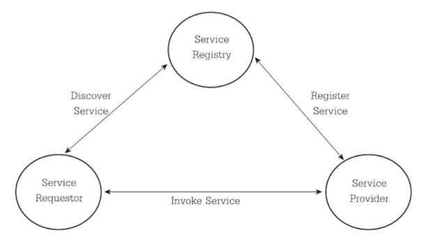
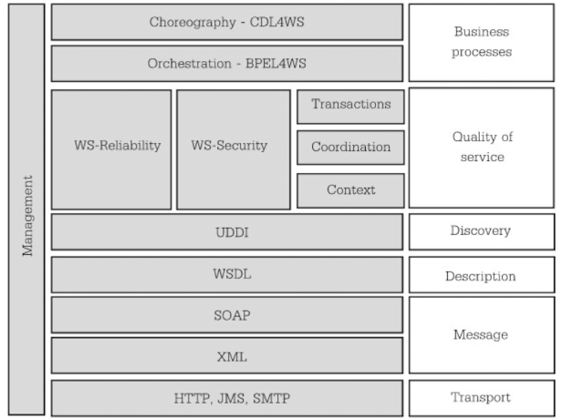

- **Component of Web Service**
  Web Service เป็น Technology ที่ประกอบด้วย Technology หลายตัวเช่น XML, WSLD, UDDI เป็นพื้นฐานที่จำเป็นในการทำ Web Service 
  ในการพัฒนา Web Application จะต้องสามารถรวบรวม Application ทั้งที่พัฒนาเองและที่อยู่ใน Network มาใช้งานตามหลักการของ SOA 
  องค์ประกอบของ Web Service ที่ทำงานร่วมกันประกอบด้วย 3 ส่วน
	- **Service Provider** (ผู้ให้บริการ):
		- พัฒนาและติดตั้ง Web Service
		- นิยามความหมายของ Service
		- ลงทะเบียน Service กับ `Service Register`
	- **Service Requester** (ผู้ขอใช้บริการ):
		- อาจเป็นลูกค้า บุคคลทั่วไป หรือเป็นการเรียกใช้จาก Application หรือระบบอื่นๆ ก็ได้
		- ค้นหาบริการ
		- ทำการเรียกใช้ (bind) เมื่อพบ Service ที่ต้องการ
		- บางครั้งถูกเรียกว่า Service Consumer
	- **Service Register** (ตัวแทนของผู้ให้บริการ)
		- เป็นตัวกลาง (`Proxy`, `Broker`, `Middleware`) ให้ผู้ให้บริการมาลงทะเบียน Service
		- มี UDDI ไว้ช่วยในการค้นหา
		- มี WSDL ไว้อธิบาย Service และวิธีเชื่อมต่อ
		- บางทีถูกเรียกว่า `Service Broker`
-
- 
  collapsed:: true
	-
-
- **Technology of Web Service**
	- **Application**
		- เป็นโปรแกรมที่ทำหน้าที่ให้บริการแก้ผู้ใช้
		- ปกติจะอยู่บนเครื่อง Web Server ตลอดเวลา
		- ติดต่อได้ด้วย HTTP
		- พัฒนาด้วยภาษาที่สามารถจัดการ SOAP ได้
		- อาจเป็น `Module Extension` หรือ `Class`
		- ผู้ใช้ไม่ต้องดูแล ผู้พัฒนาไม่ต้องแจกจ่าย
	- **SOAP**
		- เป็น Messaging Protocol
		- เป็นวิธีสื่อสารกันระหว่าง Web Service โดยการส่งข้อความ
		- ใช้รูปแบบข้อมูลเป็น XML ทำให้ Web Service สามารถสื่อสารกันได้แม้อยู่บนคนละ Platform หรือพัฒนาจากต่างภาษากัน
	- **UDDI**
		- เป็นมาตรบานการเก็บรวบรวมบริการต่างๆ ในรูปแบบของ Directory Service
		- ใช้อธิบายและค้นหา Web Service
		- ต้องมี Service Provider (ผู้ให้บริการ) มากพอมาลงทะเบียนจึงจะเกิดขึ้นได้
		- ต้องทีการประกาศบริการนี้ใน Internet
	- **WSDL**
		- เป็น XML ประเภทหนึ่ง
		- เป็นมาตรฐานใช้อธิบาย Property (คุณลักษณะ) ของการเรียกใช้และวิธีการติดต่อกับ Web Service
		- เป็นเหมือนคู่มือเพื่อให้ Application หรือระบบภายนอก รู้ถึงวิธ๊เรียกใช้งาน Web Service
	- **Technology อื่นๆ ที่เกี่ยวข้องตามลำดับชั้น**
		- 
-
- **Web Service Flow**
	- Service Provider สร้าง WSDL และประกาศไว้ที่ Directory Service (ได้ UDDI)
	- Service Consumer สอบถาม/ค้นหาบริการที่ต้องการไปยัง Directory Service
	- Service Directory ส่ง WSDL กลับมาให้ Service Consumer
	- Service Consumer ศึกษารายละเอียดใน WSDL เพื่อให้ทราบวิธีการใช้งาน แล้วส่งข้อความไปที่ Web Service โดยตรง
	- Service จะประมวลผลตามที่ถูกเรียกใช้ และส่งผลลัพท์ออการตามรูปแบบที่ระบุใน WSDL
	- การติดต่อระหว่าง Service Consumer และ Directory Serviceจะส่งข้อความ SOAP ตามแบบที่กำหนด
- **Benefit Of Web Service**
	- เข้าถึง Information จาก Application ที่แตกต่างกัน โดยสามารถเรียกใช้ข้ามเครื่องคอมพิวเตอร์ หรือระบบปฏิบัติการณ์ได้
	- สนับสนุนการเกิดพันธมิตรทางการค้า
	- การทำธุรกิจเป็นไปโดยอัตโนมัติ ไม่จำเป็นต้องใช้คนมาบริหาร
	- ลดต้นทุนในการพัฒนา
	- เพิ่มขีดความสามารถในการตอบสนองความต้องการของลูกค้าได้อย่างตล่องตัว
	- พัฒนาช่องทางการเข้าถึงข้อมูลทางธุรกิจ
	- ง่ายต่อการนำไปใช้งาน
	- สามารถเชื่อมโยง Information ภายในองค์กรได้อย่างมีประสิทธิภาพ
	-