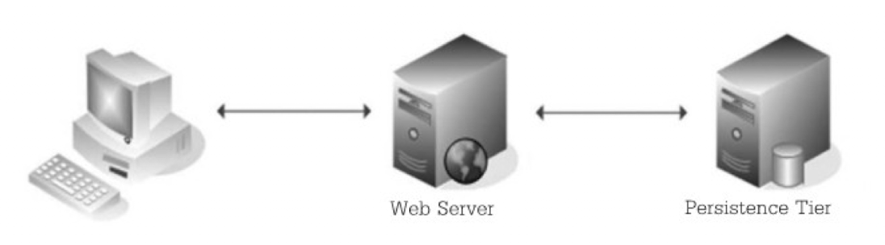

- ความเป็นมาของ SOA
	- SOA (Service Oriented Architecture) เป็นหลักการออกแบบสถาปัตยกรรมซอฟท์แวร์ (Software Architecture Design Principle) ที่รู้จักกันแพร่หลาย มุ่งเน้นให้ Application สามารถทำงานร่วมกันได้โดยไม่ขึ้นกับ Platform, Language, และ Technology ในการพัฒนา
	- SOA เป็นหลักการในการออกแบบ ดังนั้นการทำความเข้าใจและการนำไปพัฒนาให้ใช้งานได้จริงนั้นยังเป็นเรื่องยาก
	- Web Service ถูกสร้างขึ้นมาตามหลักการ SOA ทำให้หลักการนี้ได้รับความนิยม จนบางครั้ง <ins>เข้าใจผิด</ins> ว่า SOA คือ Web service
	- SOA เป็นแนวคิดหรือรูปแบบในการออกแบบ Service
	- Web Service เป็นวิธีการหนึ่งในการพัฒนา Web Application ตามหลักการของ SOA
	- แนวทางอื่นในการพัฒนาตามหลัก SOA เช่น COBRA (Common Object Request Broker Architecture) หรือ Java RMI (Remote Method Invocation)
	- SOA มีพัฒนาการมาจาก Distributed Processing แบ่งได้เป็นยุคต่างๆ :
		- Single Tier
		  
			- เหมาะสำหรับสภาพแวดล้อมที่เรียบง่าย
			- ค่าใช้จ่ายต่ำ
			- ไม่ซับซ้อน
			- ทำงานโดยการ
				- รับ Request ผ่าน HTTP/HTTPS ระหว่าง Web Browser และ Web Server
				- เมื่อ Web Server ได้รับ Request (CGI Request) จะส่งผลลัพท์ไปแสดงผลบน Web Browser
			- ไม่มีการตอบโต้กับผู้ใช้
			- อาจใช้ Firewall ที่เป็น Hardware หรือ Software ในการป้องกันผู้บุกรุกสู่ Server
				-
		- Web Tier
		  
			- เป็นการพัฒนา Web Applications ไว้บน Web Server
			- ใช้ `Java EE (Servlet/JSP)` `.NET (ASP)` หรือ `PHP`
			- รวม Presentation Logic และ Business Logic ไว้ใน Web Server
			- ผู้พัฒนาต้องหา System Service มาเพิ่มเติมเช่น `Concurrency` `Load Balancing` `Transaction` และ `Security` ทำให้การพัฒนา Web Application แบบ Web-Tier ทำได้ยากสำหรับระบบขนากใหญ่
			- Database Server จะอยู่ใน Persistence Tier
			-
		- N-Tier
		  
			- คล้ายกับ Web-Tier แต่มีการแยกส่วน Application Server ออกจาก Web Server
			- แยก Application Server เพื่อจัดการส่วนที่เป็น Service ภายในของระบบ (บางครั้งเรียก Application Server เหล่านี้ว่า Middleware)
			- การแยก Application Server ที่เป็นแต่ละ Service ออกจากกันทำให้นักพัฒนาสามารถแก้ไขระบบเฉพาะส่วนได้
			- Software Component หรือ Service ต่างๆ จะถูกสร้างแยกกัน เพื่อให้ส่วนแสดงผลเช่น Web Server เรีนกใช้งานได้
		-
		- การพัฒนาอาจใช้เทคโนโลยีดังต่อไปนี้
			- Java EE ใช้ RMI, IIOP
			- Microsoft ใช้ .NET, COM
			- Legacy ใช้ IDL/CORBA (สำหรับระบบมาตฐานทั่วไป)
		-
		- ตัวอย่าง N-Tier ใช้ Web Service
		  
			- ใช้ SOAP/REST แทน RMI/COM/CORBA
			- เอา Web Service ที่เป็น WSDL มาใช้ในการประกาศ Service
			- Java Application Server มี Feature สนับสนุนการเพิ่ม Web Service Layer อยู่แล้ว อาจจะไม่ต้องเพิ่มเครื่อง Server เพื่อทำหน้าที่ Web Service
		-
		- ตัวอย่าง N-Tier ที่ใช้ Technology ต่างค่ายมาทำงานร่วมกัน
		  
			- ใช้ IIS (ของ Microsoft) เป็น Web Server
			- ใช้ SOAP/REST เป็น Protocol เพื่อคุยกับ Web Service ที่เป็น WSDL
			- ใน Application Server สามารถพัฒนาจากภาษาหรือ Platform ที่หลากหลายเพื่อให้ทำงานร่วมกันโดยใช้มาตฐานเดียวกันได้โดยไม่ต้องแก้ไข Application
-
- Meaning of SOA
  **SOA** (Service Oriented Architecture): แนวคิดในการพัฒนาระบบงานประยุกต์ (Application) ภายในองค์กรที่มีอยู่หลากหลายให้สามารถเชื่อมโยงและแลกเปลี่ยนข้อมูลกันได้โดยอัตโนมัติมากขึ้น ไม่ว่าจะเป็นข้อมูลใน Platform หรือ Application ที่แตกต่างกันก็ตาม
	- SOA มองระบบว่าเป็นการรวมกันของ Service บริการ
	- แต่ละ Service จะเป็นเหมือน Function ที่มี method หรือหน้าที่ที่ชัดเจนบางอย่าง
	- Function ในบริการเป็นสิ่งที่ผู้ใช้ไม่ว่าจะเป็นใครสามารถเรียกใช้ได้ เช่น Application อาจจะถูกเรียกให้ทำงานโดย Application จาก Server อื่นได้
	- แต่ละ Service เป็นอิสระต่อกัน
-
- Silo-Oriented Architecture เป็นการพัฒนาระบบ IT ในแต่ละระบบต่างเป็นอิสระต่อกัน อาจมี Technology แตกต่างกันทำให้ยากแก่การเชื่อมต่อ บำรุงรักษายาก มีค่าใช้จ่ายสูง ปรับเปลี่ยนได้ยาก และพัฒนาได้ล่าช้า
- SAO จะเป็นจัดระบบ Silo ใหม่โดยแยกเป็น Layer
  
  ประกอบด้วย
	- Resource Layer: Infrastructure ต่างๆ เช่น DB , SAP
	- Service Layer: