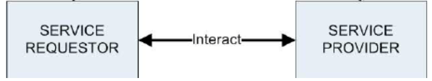

- Meaning of SOAP
	- **SOAP** (Simple Object Access Protocol): คือ protocol specification ชนิดหนึ่งที่ใช้สำหรับแลกเปลี่ยนข้อมูลระหว่าง Web Service ในรูปแบบ XML format ซึ่งจะทำให้ Service สื่อสารหากันได้แม้ว่าอยู่บน OS หรือ Platform ที่ต่างกัน
		- นิยมใช้ HTTP ร่วมในการส่งข้อมูล
		- ใช้สำหรับส่งข้อมูลบนสภาพแวดล้อมแบบกระจาย (Distributed Enviroment)
		- สามารถส่งข้อมูลไปยังปลายทางได้โดยไม่ขึ้นกับ Transport Protocol ใด
- SOAP Structure
  จุดประสงค์ของ SOAP คือกำหนดรูปแบบมาตรฐานให้ข้อความ (message)
	- มีโครงสร้างเรียบง่าย ยืดหยุ่น มีประสิทธิภาพ
	- มีโครงสร้างเป็น XML มีองค์ประกอบหลัก 3 ส่วน
	  
		- SOAP Envelope: คือ content ทั้งหมดของเอกสาร SOAP (ซองจดหมาย)
		- SOAP Headerซ ส่วนอธิบายเอกสาร SOAP จะมีหรือไม่ก็ได้ (หัวจดหมาย)
		- SOAP Body: อธิบายวิธีใช้ยริการและตัวอย่างผลลัพท์ที่ได้ (เนื้อหาของจดหมาย)
- SOAP Transmitting data
  
  เมื่อ Requester มีการส่ง Request ไปยัง Provider ทาง Provider จะประมวลแล้วส่งข้อมูลกลับไปยัง Requester ซึ่งบทบาทสามารถสลับกันได้
	-
- Meaning of UDDI (Universal Description Discovery and Integration)
	- เป็น Directory ที่เก็บรวบรวม Service หรือบริการต่างๆ (ทั้งอิเล็กโทรนิกและไม่อิเล็กโทรนิก) ที่ลงทะเบียนไว้
	- เก็บข้อมูลในรูปแบบ WSDL
	- เป็นข้อกำหนดที่จัดตั้งขึ้น (Protocol) สำหรับรองรับการทำงานระหว่างบริษัทหรือองค์การต่างๆ
	- เป็นเหมือนฐานข้อมูลขนาดใหญ่ ใช้ค้นหาแบ่งปันบริการต่างๆ และจัดการปรับปรุงข้อมูลของ Web Service
	- มีข้อมูลที่เกี่ยวข้องกับบริการหรือผลิตภัณฑ์
	- เหมือนเป็นสมุดโทรศัพท์หน้าเหลือง
-
- Roles of UDDI
	- ลงทะเบียน (Registry)
		- Public เป็นการจัดตั้งข้อกำหนดของ UDDI โดยผู้ผลิตชั้นนำในตลาดเช่น IBM หรือ Microsoft
		- Private เป็นการจัดตั้งข้อกำหนดของ UDDI ภายในกลุ่มคู่ค้า
	- การประกาศบริการ (Service Publication)
		- สร้างและอับเดตข้อมูลให้ทันสมัย การย้ายข้อมูลที่สัมพันธกับธุรกิจหรือบริการขององค์กรต่างๆ
		- เป็นหน้าที่ของผู้ดูแลระบบ
		- การประกาศจะทำงานผ่าน Application ที่รองรับโดยเฉพาะ Application นี้ติดต่อกับ Registry ด้วย SOAP
	- การสร้างและปรับปรุงบริการ (Service Creating and Modification)
		- ปรับข้อมูลของบริการต่างๆ ให้มีปริมาณเหมาะสมตามความจำเป็น
		- ลบข้อมูลที่ไม่ได้ใช้ หรือไม่มีความสำคัญ
		- เพิ่มเติมข้อมูลที่มีความจำเป็น
		- การปรับปรุงข้อมูลทำได้โดยใช้ SOAP message
	- การลบบริการ (Service Removing)
		- คล้ายกับการสร้างและปรับปรุงบริการ
		- การลบต้องระบุ UUID เพื่อใช้ในการลบ
	- การค้นหาบริการ
		- ผู้ใช้จะค้นหาบริการผ่าน Application ที่สร้างขึ้นเพื่อค้นหาบริการจาก UDDI Registry
		- ใช้ SOAP เป็นตัวกลางในการติดต่อ
		- สามารถแบ่งการค้นหาได้ 2 ระดับ
			- Information Browsing: ข้อมูลไม่ลึกมาก มีเพียงรายละเอียดของบริการ ไม่ระบุตัวตน
			- Information Drill-down: ดูข้อมูลโดยละเอียดของบริการนั้นๆ
-
- คำศัพท์ที่ควรจำ
	- UUID (Universal Unique Identification): เป็นค่าเอกลักษณ์ที่ถูกสร้างขึ้นด้วย Algorithm ให้มีความแตกต่างกัน โดยมีความเป็นได้ที่ UUID ที่ถูกสร้างขึ้นอย่างถูกต้องจะซ้ำกันนั้นมีความเป็นได้ต่ำมาก ซึ่งรูปแบบของ UUID ถูกกำหนดไว้ใน RFC4122 โดยปัจจุบัน UUID มี 5 version ซึ่งมีความต่างกันในแง่ของ Algorithm ที่ใช้ในการสร้างดังนี้
		- v1: timebase
		- v2: DCE Security
		- v3: namebase (MD5)
		- v4: Random
		- v5: namebase (SHA-1)