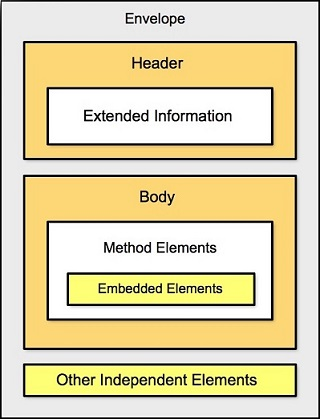

- Meaning of SOAP
	- **SOAP** (Simple Object Access Protocol): คือ protocol specification ชนิดหนึ่งที่ใช้สำหรับแลกเปลี่ยนข้อมูลระหว่าง Web Service ในรูปแบบ XML format ซึ่งจะทำให้ Service สื่อสารหากันได้แม้ว่าอยู่บน OS หรือ Platform ที่ต่างกัน
		- นิยมใช้ HTTP ร่วมในการส่งข้อมูล
		- ใช้สำหรับส่งข้อมูลบนสภาพแวดล้อมแบบกระจาย (Distributed Enviroment)
		- สามารถส่งข้อมูลไปยังปลายทางได้โดยไม่ขึ้นกับ Transport Protocol ใด
- SOAP Structure
  จุดประสงค์ของ SOAP คือกำหนดรูปแบบมาตรฐานให้ข้อความ (message)
	- มีโครงสร้างเรียบง่าย ยืดหยุ่น มีประสิทธิภาพ
	- มีโครงสร้างเป็น XML มีองค์ประกอบหลัก 3 ส่วน
	  
		- SOAP Envelope: คือ content ทั้งหมดของเอกสาร SOAP (ซองจดหมาย)
		- SOAP Headerซ ส่วนอธิบายเอกสาร SOAP จะมีหรือไม่ก็ได้ (หัวจดหมาย)
		- SOAP Body: อธิบายวิธีใช้ยริการและตัวอย่างผลลัพท์ที่ได้ (เนื้อหาของจดหมาย)
- SOAP Transmitting data
  
  เมื่อ Requester มีการส่ง Request ไปยัง Provider ทาง Provider จะประมวลแล้วส่งข้อมูลกลับไปยัง Requester ซึ่งบทบาทสามารถสลับกันได้
	-
-
	-