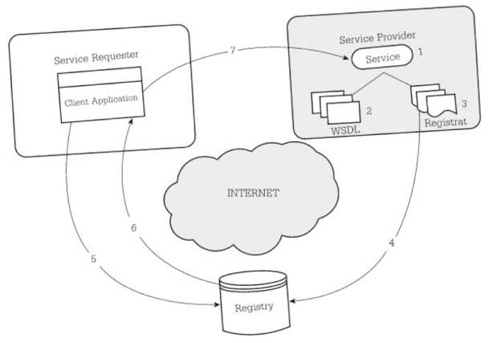

- ตัวอย่าง php การโค้ดเพื่อร้องขอบริการโดยไม่ใช้ WSDL
  ```php
  <?php
  $client = new SoapClient(
      NULL,
      array(
          "location" => "http://64.124.140.30:9090/soap",
          "uri" => "urn:xmethod-delayed-qoutes",
          "style" => SOAP_PRC,
          "use" => SOAP_ENCODED
        ));
  
  print(
      $slient->__call(
          /* SOAP Method Name*/
          "getQoute",
          /* Parameters */
          array(
            new SoapParam(
              /* Parameter Value */
              "ibm",
              /* Parameter Name */
              "symbol"
          )),
          array(
            /* SOAP Method Namespace */
            "uri" => "urn:xmethods-delayed-qoutes",
            /* SOAPAction HTTP Header for SOAP Method */
            "soapaction" => "urn:xmethods-delayed-quotes#getQuote"
          )
          , "\n"
      ));
  ?>
  ```
	- เมื่ออ้างอิงตาม code นี้จะมีข้อมูลดังนี้
		- ที่ Web Service จะมี Function ชื่อ `getQoute`
		- ที่ Web Service จะมี URL `http://64.124.140.30:9090/soap`
		- ต้องใช้ SOAP Action Header `urn:xmethods-delayed-quotes#getQuote`
		- ต้องใช้ Namespace URI `urn:xmethods-delayed-qoutes`
		- ชื่อ Input หรือ Output คือ `symbol`
	- มีความซับซ้อนและผู้ใช้งานจำเป็นต้องรู้ว่าจะต้องกำหนดค่าพวกนี้ยังไง
-
- ตัวอย่าง php การโค้ดเพื่อร้องขอบริการโดยใช้ WSDL
  ```php
  <?php
    $client = new SoapClient(
      "http://services.xmethods.net/soap.urn:xmethods-delayed-qoutes.wsdl"
    );
    print($client->getQoute("ibm"))
  ?>
  ```
	- เมื่อใช้งาน WSDL ที่ผู้พัฒนาเตรียมไว้ให้ ก็สามารถเรียกใช้งาน Function ได้ทันที
	- module SOAP ของแต่ละภาษาสามารถเรียกดู Function และ Parameter ต่างๆ ของ Web Service ได้
-
- กระบวนการร้องขอบริการ (Service Request Process)
  
	- มีองค์ประกอบ 3 ส่วน
		- Server Application หรือ Service Provider
		- Client Application หรือ Service Requester
		- Registry หรือ Service Broker
	- มีขั้นตอนการทำงานดังนี้
		- Service Provider สร้าง Web Service
		- Service Provider สร้างเอกสาร WSDL
		- สร้าง Application หรือใช้ Registry Software เพื่อ Publish เอกสาร WSDL ไว้บน Registry
		- สร้าง Registrar แล้ว Publish เอกสารลงบน Registry
		- Service Requester ค้นหาข้อมูลที่ต้องการบน Registry
		- Registry ส่ง WSDL ให้ Requester
		- Service Requester จะใช้ SOAP Request/Response ผ่าน Protocol HTTP