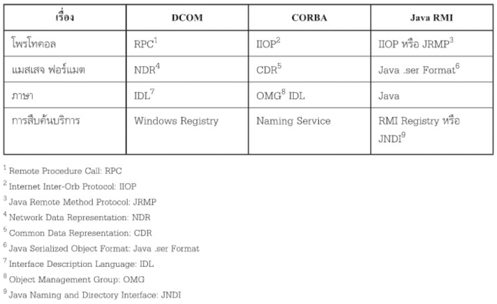

- Origin of Web Servicing Concept
	- System Development problem in Organization: เกิดจาก
		- ต้องการใช้งานทรัพยาการสารสนเทศผ่าน Internet จึงมีการพัฒนาระบบงานขึ้นมามาก
		- ระบบงานที่พัฒนาขึ้นมาไม่สามารถทำงานร่วมกันได้
		- ยุ่งยากและค่าใช้จ่ายสูงเนื่องจากขาดความสามารถในการจัดการระบบ IT
	- Co-Operating and Data exchange problem between Organization
		- การแลกเปลี่นข้อมูลมีความสำคัญมาขึ้นเพราะการพัฒนาของ Internet
		- องค์กรต่างๆ ใช้ Platform OS และพัฒนาระบบงานมาแตกต่างกัน
		- การส่งข้อมูลหากันต้องมีการปรับเปลี่ยน Format ให้เข้ากันได้ ซึ่งยุ่งยากและค่าใช้จ่ายสูง
- Web Servicing Concept
	- Concept to Solving System Development problem in Organization: เปลี่ยนวิธีใช้ Software ที่จากเดิมพัฒนาเอง มาเป็นการใช้บริการจากผู้ผลิตต่างๆ แทน
		- Background of Software as a Service
			- ASP (Application Service Provision): คือการให้บริการ Application แบบ Pay per Use หรือเป็นสัญญาเช่า
			- ค่อนข้างล้ำหน้าในยุคก่อนจึงไม่เป็นที่นิยม เป็นที่นิยมมากขึ้นในยุคหลังเมื่อสภาพการใช้งาน Internet พัฒนาขึ้นและมีการถดถอยทางเศรษฐกิจ
			- องค์กรสามารถใช้เป็นเครื่องมือเพิ่มศักยภาพในการแข่งขันด้วยต้นทุนที่ต่ำลงได้
		- Using Type of Software as a Service
			- เมื่อ Software กลายป็นบริการ ที่เหมือนสาธารณูปโภคจึงสามารถจ่ายค่าบริการให้สอดคล้องกับการใช้งานได้ เช่นคิดราคาเป็นรายปี รายเดือน หรือตามจำนวนผูใช้งาน
			- ผู้ให้บริการจะเป็นผู้ดำเนินการ ดูแลพัฒนา ติดตั้ง upgrade จัดเก็บข้อมูล และให้บริการทั้งหมดแก่ผู้ใช้บริการ
			- สามารถใช้งานได้ผ่าน Web Browser ได้ทุกที่ ทุกเวลา
			- เป็นทางเลือกของผู้ประกอบการขนาดกลางและเล็ก
			- ระบบที่เป็นที่นิยมมากจาก Gartner 2552 เช่น
				- CRM
				- HRM
				- Procurement
				- Document Management
				- Supply Chain Management
				- Office Suite
				- Collaboration
				- Web Conference
				- Container Allocation Analysis
				- Help Desk Management
		- Benefit of Using Software as a Service
			- ลดค่าใช้จ่าย
			- คำนวนค่าใช้จ่ายได้ชัดเจน ทำให้รับทราบผลตอบแทนจากการลงทุนได้ดีขึ้น
		- Limitation of Using Software as a Service
			- ถูกออกแบบมาเพื่อรองรับผู้ใช้จำนวนมาก การแก้ไขให้ตรงความต้องการของผู้ใช้แต่ละรายทำได้ยาก
			- ยังไม่สามารถแก้ปัญหาความหลากหลายของระบบงานภายในองค์กรได้
			- ยังไม่สามารถแก้ปัญหาการประสานงานข้ามองค์กรได้
	- Concept to Solving Co-Operating and Data exchange problem between Organization: แก้ไขได้โดยใช้  IT ที่มีมาตรฐานกลางเป็นมาตรฐานในการแลกเปลี่ยนข้อมูล มาตรฐานดังกล่าวคือ Web Service ในรูปแบบดังนี้
		- Web Servicing and Distributed Computing
			- เกิดจาก Technology หลากหลายที่บริษัทผู้ผลิดซอฟท์แวร์รายใหญ่สร้างขึ้น
			- มีมาก่อน Web Servicing
			- ประสิทธิภาพการประมวลผลเกิดจากการกระจายการประมวลผลข้อมูลไปยัง Node บน Network
			- ใช้หลักการการประมวลผลแบบขนาน (Parallel Processing) เช่น
				- Client-Server Application
			- ยังต้องทำงานบน Platform เดียวกัน
			- มีความยุ่งยากในการพัฒนา
			- ใช้ Middleware เป็นตัวกลางในการสื่อสาร
				- Middleware ไม่ได้เป็นส่วนหนึ่งของ OS ตัวอย่างเช่น
					- Java RMI: Remote Method Invocation
					- COBRA
					- DCOM
				- ยังมีความแตกต่างกันในเรื่องของรูปแบบข้อมูลและ Technology ที่ใช้ รวมถึงการทำงานบน Platform ที่ต่างกัน
			-  ตารางเทียบความต่างของ Middleware หลักๆ ใน Distributed Computing Technology
		- Web Servicing and Web Application Technology:
			- พัฒนาต่อยอดมากจาก Distributed Computing Technology และ Web Application
			- มีลักษณะที่ประกอบโดยส่วนย่อยๆ ที่มีความสมบูรณ์ในตัวของมันเอง
			- ติดตั้ง ค้นหา และเริ่มทำงานได้ผ่านเว็บ
			- มีความสามารถหลากหลายตั้งแต่การดึงข้อมูลง่ายๆ ไปถึงการคำนวนที่ซับซ้อน
			- ใช้เว็บเป็นตัวประสานงานของ Middleware หลายๆ ตัวเพื่อให้ Application แต่ละตัวสามารถสื่อสารกันได้
			- จากมุมมองของ n-tier application การใช้งาน listener interface จะเป็นกลไกในการเข้าถึงบริการของแต่ละ Middleware ต่างๆ
			- ได้รับการยอมรับจากการผลักดันมาตรฐาน XML และต่อยอดจาก Web Application
			- มีความแตกต่างจาก Web Application หลายด้าน
				- Interfacing:
					- Web Servicing เป็นการ interface กันระหว่างโปรแกรมกับโปรแกรม
					- Web Application เป็นการ interface กันระหว่างมนุษย์กับโปรแกรม
				- Programing Language
					- Web Servicing ใช้ XML
					- Web Application ใช้ HTML
				- Service Browsing
					- Web Servicing ใช้ UDDI
					- Web Application ใช้ Search Engine
				- Domain
					- Web Servicing ครอบคลุม B2B (Business to Business)
					- Web Application ครอบคลุม B2C (Business to Consumer)
				- Protocol
					- Web Servicing ใช้ SOAP + HTTP/HTTPS/SMTP
					- Web Application ใช้ HTTP/HTTPS
		- Benefit of using Web Servicing to solve Co-Operating and Data exchange problem between Organization
			- Automatically Web Service Requesting
				- ใช้ WSDL ช่วยทำให้การเรียกใช้ Web Service เป็นไปโดยอัตโนมัติ
			- Communication between difference Platform Software
				- ใช้ XML เป็นภาษากลางในการสร้าง SOAP message ทำให้ Applicaiton หรือ Service ที่อยู่บน Platform ที่แตกต่างกันสามารถติดต่อกันได้
			- Automatically Communication between Service Provider and Requester
				- XML มีโครงสร้างที่เป็น self-explain ทำให้ SOAP message สามารถถูกจัดการได้โดยการโปรแกรม ซึ่งช่วยให้การติดต่อระหว่าง Provider และ Requester เป็นไปโดยอัตโนมัติ
-
- สรุป: แนวคิดของ Web Servicing
	- เป็นแนวคิดในการสื่อสารระหว่าง Application ที่เป็นอิสระจาก Platform ของ `Hardware` `OS` `Software` `Network`
	- มีจุดมุ่งหมายเพื่อให้เกิดการติดต่อระหว่าง A2A (Application to Application) หรือ P2P (Program to Program) โดยอัตโนมัติ
	- การติดต่อกันใช้ประโยชน์จากมาตฐานเปิด (Open Standard) และ โครงสร้างพื้นฐานของ Network
	- หลักการการออกแบบนี้สามารถใช้ระบุได้ว่า Web Service ถูกออกแบบมาเพื่อรองรับการทำงานร่วมกันระหว่าง Applicaiton อย่างมีประสิทธิภาพ โดยดูได้จาก
		- คุณลักษณะ
		- องค์ประกอบ
		- โครงสร้าง
		- สถาปัตยกรรม
		- กระบวนการทำงาน
		- มาตรฐาน