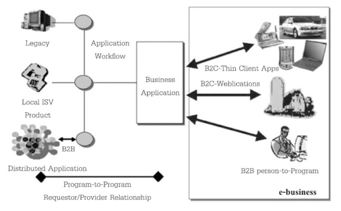

- The evolution of Web Services and Electronic Businesses
	- First Generation
		- เป็น Web แบบ Static
		- ใช้ HTML เป็นหลัก
		- ติดต่อกันด้วย HTTP
	- Second Generation
		- มีการเชื่อต่อกับ DB
		- มีการประมวลผล เช่น
			- ระบบ Catalog สินค้า
			- ระบบจัดการสินค้าคงคลัง
			- ระบบสั่งสินค้า
			- ระบบ Front-ends/Back-ends
		- เน้นผู้ให้บริการเป็นสำคัญ (Vendor-Centric)
		- ลดต้นทุนในการดำเนินการ และอำนวยความสะดวก
		- เชื่อมต่อกระบวนการของระบบเข้ากับ Internet เพื่อให้บริการ
	- Third Generation
		- เพิ่มประโยชน์ให้กับการดำเนินการอัตโนมัติ
		- ภายใต้การควบคุมของ Business Rules จะสามารถ
			- ระบบนำเสนอข้อมูลไปที่เครื่องของ User โดยตรง
			- เครื่องของ User สามารถเรียกใช้บริการและโปรแกรมจากเครื่องผู้ให้บริการได้โดยตรง
- The need to link information across organizations in the electronics business
  
	- Dynamic e-business คือความต้องให้ธุรกิจที่ดำเนินการผ่าน Internet จะสามารถทำการติดต่อสื่อสารกันได้แบบอัตโนมัติ ทั้งแบบ P2P หรือ A2A
	- สามารถดำเนินกิจกรรมทางธุรกิจที่มีความซับซ้อนได้ภายใค้การควบคุมของ Business Rule เช่น
		- นำเสนอข้อมูลไปยังผู้รับบริการโดยตรงแบบ B2B และ B2C
		- รองรับการติดต่อจากอุปกรณ์ต่างๆ ของผู้ขอรับบริการด้วย Software สำหรับ Clinet หรือ Thin Client Apps โดยการประมวลผลจะทำที่ Server หรือใช้ Softwware ที่พัฒนาบนเว็บอย่าง Webplications
		- การเรียกใช้บริการโดยตรงจากผู้ขอรับบริการไปยังโปรแกรมโดยตรง (Person to Program)
		- สามารถติดต่อได้ทั้งระบบ Legacy, Business Application, ISV(Independent Software Vendor) หรือ Distributed Application
- Basic principles for managing the complexity of system-to-system integration
	- Loosely Couple: การรวมกัน ต้องยอมให้ระบบเหล่านี้เป็นอิสระจากกัน
	- Interface: เปิดเผยเป็นสาธารณะ
	- Message: ใช้ Open-Standard
	- Software Component: สามารถสร้าง Application ขึ้นมาจาก Software Component ภายนอกบริษัทได้ตามแนวทางของบริษัท
	- Source of Software Component: ที่มาของ Software Component ต้องเข้าถึงได้ง่ายเพื่อเพิ่มความยืดหยุ่น
	- Reusable: เพื่อลดต้นทุน และช่วยปรับปรุงประสิทธิภาพในการบริการแก่ลุกค้า
	- Serviceability: Software ต้องสามารถกลายเป็น Service ได้
- Objectives of developing web services
	- เพื่อให้มีความเข้ากันได้ระหว่างระบบสูงขึ้น โดยใช้มาตฐานกลางเช่น XML
	- เพื่อให้สามารถเชื่อมต่อกับระบบที่อยู่ห่างไกลได้สะดวก เช่นการวาง Software Compoment ไว้ตามที่ต่างๆ ของระบบแล้วเรียกใช้งานผ่าน Network เมื่อทำการแก้ไข Software Component ตัวใดก็จะมีผลไปทั่ว Network ทันที
	- เพื่อสนับสนุนการนำ Component มา Reuse โดยเขียน Software เป็น Library แล้วนำไปเก็บไว้ที่ Server แทนการรวมกับ Application
	- เพื่อสนับสนุนการส่งข้อมูลข้าม Application โดยสะดวก ไม่ขึ้นกับ Platform หรือ ภาษาที่ใช้พัฒนา
- Principles and reasons for developing a web-based service system
	- Web Services แตกต่างจาก Web Application และ Application ที่ใช้ Distributed Computing
	  มีความต่างกันในแง่ของ Protocol และหลักการที่ใช้ใน Technogoly Distributed Computing
		- Web Application เป็นโปรแกรมเพื่อ End-User สามารถโต้ตอบกับผู้ใช้ผ่าน Web ได้ แต่ Application ที่ใช้ Distributed Computing เป็น Software Service ไม่สามารถเรียกใช้จาก User หลากหลายได้
		- Application ที่ใช้ Distributed Computing มีข้อจำกัดที่การยึดติดกับ Protocol เฉพาะที่เป็นของ Technology นั้นๆ เช่น `RMI` `COBRA`
	- เหตุผลและข้อดีที่ควรเลือกพัฒนาระบบงานเป็น Web Services มากกว่าที่จะเลือก Web Application หรือ Application ที่ใช้ Distributed Computing
		- Web Services ใช้ Protocol มาตฐานรูปแบบ XML
		- Web Services สามารถเรียกใช้ได้จาก XML-based RPC + HTTP จึงทำให้เรียกใช้ผ่านการป้องกันของ Firewall ได้
		- Web Services สนับสนุน Solution ในการข้าม Platform โดยใช้ XML
		- Web Services สามารถถูกรียกใช้จาก Application อื่นๆ ได้ผ่าน Internet Protocol แต่ Web Application จะเป็นการเรียกใช้โดยตรงจาก User
		- Web Services มีจุดเด่นหลายข้อคือ
			- Interoperability
			- Economical
			- Autometic
			- Accessible
			- Available
			- Scalable