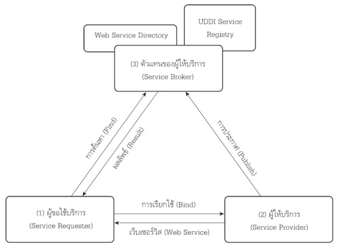
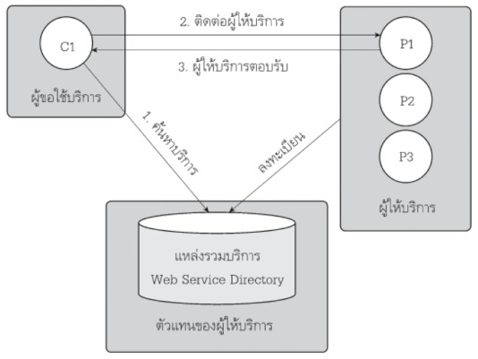
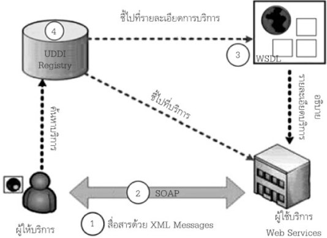
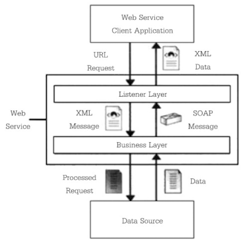
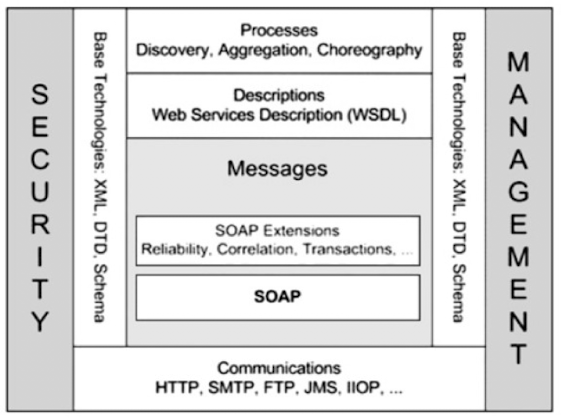

- Web service models: Application อื่นจะเรียกใช้ Web Services ด้วย RPC (Remote Procedure Call) มีเอกสารอธิบายการใช้งานกำกับไว้ ใช้ XML เป็นภาษากลาง ใช้งานร่วมกันได้หลาย Platform ผ่าน Protocol HTTP 
	- Service Requester: ผู้เรียกใช้บริการ ค้นหาบริการที่ต้องการจาก UDDI หรือเรียกไปที่ผู้ใช้บริการโดยตรง
	- Service Provider: ผู้ให้บริการ มีหน้าที่เปิดบริการรองรับการขอใช้บริการ
	- Service Broker: นายทะเบียน เป็นตัวกลางให้ผู้ให้บริการมาลงทะเบียน ใช้ WSDL บอกรายละเอียดของบริการ
- Workflow and service calling steps within the web service model
	- Provider จะ Publish บริการของตัวเองโดยลงทะเบียนกับ Service Broker
	  logseq.order-list-type:: number
	- Broker จะรวบรวมข้อมูลของบริการ แล้วใช้ UDDI ในการให้บริการค้นหา
	  logseq.order-list-type:: number
	- Requester จะค้นหาบริการที่ต้องการใช้งานจาก UDDI แล้วใช้ข้อมูลจาก WSDL เพื่อเป็นข้อมูลในติดต่อกับ Service ที่ต้องการต่อไป
	  logseq.order-list-type:: number
	- 
	- ค้นหาบริการ หากมีเอกสาร WSDL อยู่แล้ว สามารถข้ามขั้นตอนนี้ได้เลย
	  logseq.order-list-type:: number
	- ติดต่อด้วย Web Application หรือเขียนโปรแกรมมาเรียกใช้ Method โดยอ้างอิง WSDL
	  logseq.order-list-type:: number
	- ส่ง Result กลับไปยังผู้ให้บริการ
	  logseq.order-list-type:: number
- Events in Web Services Architecture: Web Service Model มีโครงสร้าง Architecture หลัก 3 อย่าง
	- Service
	  logseq.order-list-type:: number
	- Service Requester
	  logseq.order-list-type:: number
	- Service Container
	  logseq.order-list-type:: number
	- จาก 3 อย่างนี้ จะทำให้เกิด Event ดังนี้:
		- Create Service: สร้าง Service จากเครื่องมือที่เหมาะสม
		  logseq.order-list-type:: number
		- Publish: การ publish service บน UDDI Registry ในรูปแบบของ WSDL
		  logseq.order-list-type:: number
		- Find: Requester ค้นหาบริการผ่าน Service Provider Interface
		  logseq.order-list-type:: number
		- Reference: ผลลัพท์ของการค้นหา ประกอบด้วย reference และ specification
		  logseq.order-list-type:: number
		- Bind: Request ใช้ Reference ที่เลือกขึ้นมาเพื่อ Bind ไปยัง Service ที่ต้องการ
		  logseq.order-list-type:: number
		- Invoke: การเรียกใช้ Service โดยใช้ Technology มาตรฐานเช่น SOAP
		  logseq.order-list-type:: number
- Web Services Component:
  
	- XML: Markup Language ที่มีลักษณะเป็นข้อความธรรมดา ไม่ขึ้นกับ Platform
	  logseq.order-list-type:: number
	- SOAP: Protocol มาตรฐานในการส่ง message ที่มีรูปแบบ XML สามารถใช้คู่กับ Internet Protocol ได้หลากหลาย
	  logseq.order-list-type:: number
	- WSDL: document ที่มีไว้เพื่ออธิบายรายละเอียดของ web service เช่น address, connection method, invocation method
	  logseq.order-list-type:: number
	- UDDI: Service Registry มีไว้เพื่อให้ Service Request ทำการ publish service และให้ Service Requester ทำการค้นหา Service
	  logseq.order-list-type:: number
- Web services layer based on web services architecture standards
	- Listener Layer: ชั้นบนสุด มีไว้เพื่อรับ Request จาก Client แล้วส่งต่อไปยัง Layer ถัดไป
	  logseq.order-list-type:: number
	- Business Layer: เป็นที่เก็บ Business Logic แยกได้ 2 Layer ย่อย
	  logseq.order-list-type:: number
		- Business Logic Layer: จัดการ Function และ Service ของ Web Service
		  logseq.order-list-type:: number
		- Business Facade Layer: จัดเตรียม Interface ในการให้บริการ
		  logseq.order-list-type:: number
	- ดูตัวอย่างขั้นตอนวิธีได้จากภาพนี้ โดยดูลูกศรเริ่มจากบนลงล่าง ซ้ายไปขวา 
	  {:height 490, :width 476}
-
- Web service Stack, designed by W3C: จากรูปนี้ ทาง W3C ได้ออกแบบลำดับชั้นมาตรฐาน (Stack) ของ Web Service ไว้ดังนี้
  
	- Process Layer: จัดการ Discovery (ค้นหา), Aggregation (การรวม), Choreography (ขั้นตอน/จังหวะการทำงาน)
	  logseq.order-list-type:: number
	- Description Layer: เป็นชั้นที่จัดการ WSDL
	  logseq.order-list-type:: number
	- Message Layer:
	  logseq.order-list-type:: number
		- SOAP Extension จัดการเรื่อง Reliability, Correction, Transaction
		  logseq.order-list-type:: number
		- SOAP จัดการ message ตามมาตรฐาน SOAP
		  logseq.order-list-type:: number
	- Communication Layer: จัดการการสื่อสารใน Network ตามมาตฐานของ Internet Protocol เช่น HTTP SMTP FTP JMS IIOP
	  logseq.order-list-type:: number
	- Vertical Layer เป็น Framework เกี่ยวข้องกับ Business Issues:
		- Management Layer: จัดการ Policy
		  logseq.order-list-type:: number
			- Security Layer: จัดการ Security ของ Service
			  logseq.order-list-type:: number
	- Message Description Communication ทำงานตามมาตฐานของ XML-DTD และ Schema