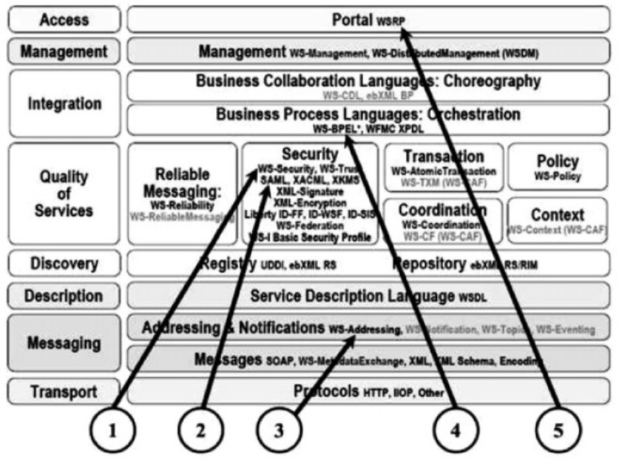

- Basic standards for web services: เกิดจาก Open Standard ที่รับผิดชอบโดย `OASIS` `W3C` `WS-I` `IETF` กลายเป็น Framework ที่เป็นมาตรฐานการทำงานดังภาพ
  
	- XML เป็นภาษากลางในการส่ง message ผ่านระบบเครือข่ายให้ Web Services ต่าง Platform กันสามารถสื่อสารกันได้ในมาตรฐานเดียวกัน ปัจจุบันมี 2 version คือ 1.0 และ 1.1 แต่ W3C ไม่แนะนำให้ใช้ 1.1 ถ้าไม่จำเป็น
	- SOAP เป็น Component และ Message Protocol ที่กำหนกรูปแบบการส่งข้อมูลในณุปแบบ XML ผ่าน Internet Protocol เช่น HTTP หรือ SMTP
		- มีโครงสร้างประกอบด้วย 3 ส่วนคือ
			- SOAP Envelope เป็นที่ใช้บรรจุข้อมูลและกระบวนการส่งข้อมูล
			- SOAP Transport ใช้อธิบาย Protocol ในการส่งข้อมูลเช่นเป็น HTTP หรือ SMTP
			- SOAP Encoding ใช้อธิบาย Data type ที่ใช้ระบุประเภทข้อมูลใน XML Element
		- SOAP เป็นเหมืนอซองจดหมาย ที่มีการจ่าหน้าซองว่าจะต้องส่งยังไง และ HTTP (หรือ Internet Protocol อื่นๆ) เป็นบุรุษไปรษณีย์ การส่ง SOAP message มี 2 แบบคือ
			- SOAP-RPC
				- เป็นแบบ Synchronous
				- ส่ง SOAP Request เพื่อเรียกใช้ Method หรือ Procedure
				- จะต้องรอเพื่อให้ได้ SOAP Response กลับมา
			- SOAP-message
				- เป็นแบบ Asynchronous และ Synchronous
		- Version ล่าสุดคือ 1.2 (ทั้งหมดคือ `1.0` `1.1` `1.2`)
		- SOAP มีความเป็นกลางในการส่งข้อมูลระหว่าง Platform จึงสามารถนำใช้ในการแลกเปลี่ยนข้อมูลระหว่างหน่วยงานได้ง่ายดังภาพประกอบ
		  
	- WSDL ใช้อธิบาย Configuration ของ Web Services
		- ประกอบ 4 ส่วน
			- Interface: ใช้อธิบายว่ามี Function อะไรให้เรียกใช้บ้าง
			- Data Type: ใช้บอกประเภทของข้อมูลว่าต้องส่งเป็นอะไรเช่นเป็นตัวเลข หรือตัวอักษร
			- Binding: ใช้อธิบายการใช้งาน Protocol
			- Address: ใช้ระบุที่อยู่ของ Web Services
		- WSDL ปัจจุบันมี 2 version คือ 1.1 และ 1.2 ที่ถูกเปลี่ยนชื่อเป็น 2.0 มีลักษณะที่ต่างกันดังตารางนี้
		  
	- UDDI เป็นมาตรฐานของ API เพื่อให้ SOAP เรียกใช้
		- version สุดท้ายคือ 3.0.2
		- ปัจจุบันยกเลิกบริการลงทะเบียนแล้ว
- Other standards for web services
  
  จากรูป
	- ในการใช้งานจริง จำเป็นต้องคำนึงถึงมาตฐานอื่นๆ ที่เกี่ยวข้องด้วย
		- 1 ) WS-Security เป็น Framework เพื่อเชื่อมต่อกับเทคโนโลยีความปลอดภัยต่างๆ
		- 2 ) SAML (Security Assertion Markup Language) เป็นมาตรฐานที่ทาง OASIS กำหนดขึ้นเพื่อ Support SSO และ Authentication
		- 3 ) WS-Addressing ใช้ใน SOAP Header เพื่อระบุ Communication Protocol และ Information System
		- 4 ) WS-BPEL (Web Services Business Process Execution Language) เป็นมาตรฐานสำหรับการทำ orchestration ของ Business Process ด้วยภาษา XML
		- 5 ) WSRP (Web Services for Remote Portal) เป็นมาตรฐานสำหรับการเรียกใช้ Web Services จาก Portal
	- ยังมีมาตรฐานที่เกี่ยวข้องกับการบริการผ่านเว็บอื่นๆอีก สามารถจําแนกกลุ่มมาตรฐานได้ถึง 11 กลุ่มดังนี้
		- 1) ประเด็นการประสานและการทํางานร่วมกันข้ามแพลตฟอร์ม (Interoperability Issues)
		- 2) ข้อกําหนดของกระบวนการทางธุรกิจ (Business Process Specifications)
		- 3) ข้อกําหนดด้านการจัดการ (Management Specifications)
		- 4) ข้อกําหนดด้านการนําเสนอ (Presentation Specifications)
		- 5) ข้อกําหนดด้านเมตาดาต้า (Metadata Specifications)
		- 6) ข้อกําหนดเรื่องความน่าเชื่อถือ (Reliability Specifications)
		- 7) ข้อกําหนดด้านความปลอดภัย (Security Specifications)
		- 8) ข้อกําหนดด้านรายการทรานแชคชัน (Transaction Specifications)
		- 9) ข้อกําหนดด้านทรัพยากร (Resource Specification)
		- 10) ข้อกําหนด้านแมสเสจจิ้ง(MessagingSpecifications)
		- 11) ข้อกําหนดด้านเอ็กซ์เอ็มแอล (XML Specifications)