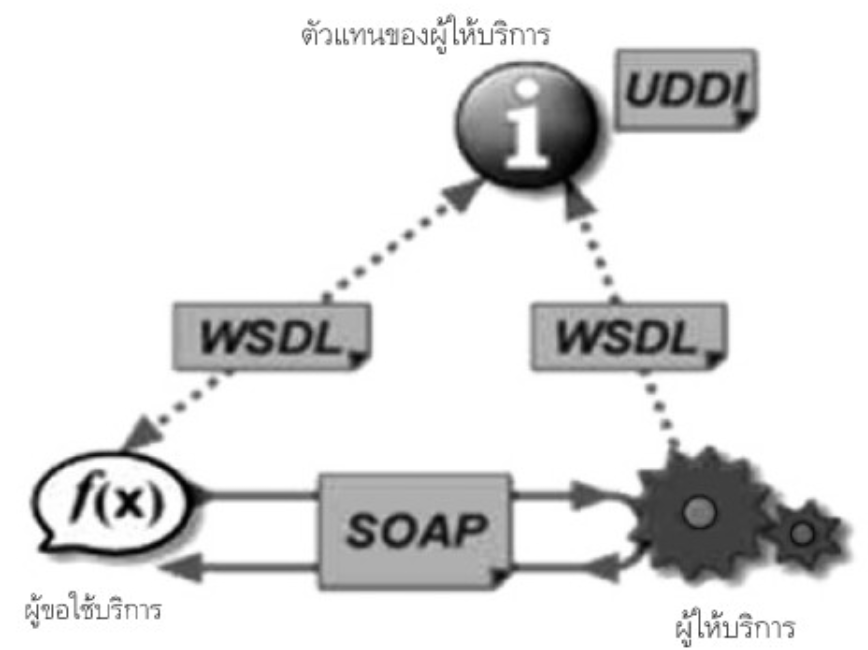
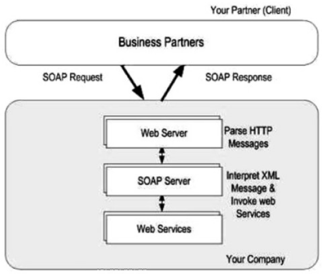
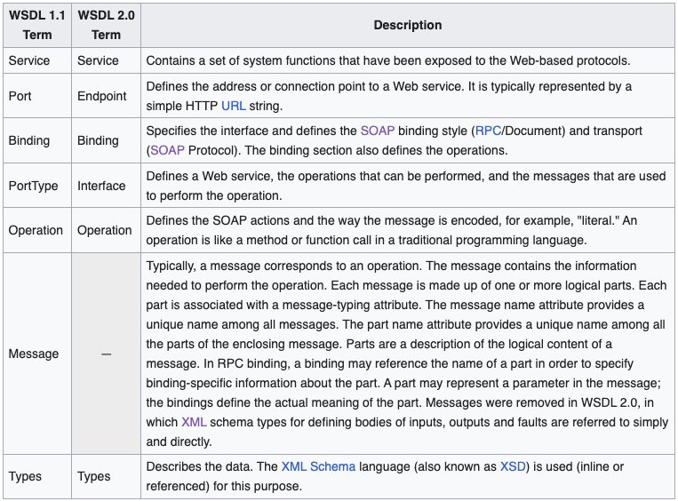

- Basic standards for web services: เกิดจาก Open Standard ที่รับผิดชอบโดย `OASIS` `W3C` `WS-I` `IETF` กลายเป็น Framework ที่เป็นมาตรฐานการทำงานดังภาพ
  
	- XML เป็นภาษากลางในการส่ง message ผ่านระบบเครือข่ายให้ Web Services ต่าง Platform กันสามารถสื่อสารกันได้ในมาตรฐานเดียวกัน ปัจจุบันมี 2 version คือ 1.0 และ 1.1 แต่ W3C ไม่แนะนำให้ใช้ 1.1 ถ้าไม่จำเป็น
	- SOAP เป็น Component และ Message Protocol ที่กำหนกรูปแบบการส่งข้อมูลในณุปแบบ XML ผ่าน Internet Protocol เช่น HTTP หรือ SMTP
		- มีโครงสร้างประกอบด้วย 3 ส่วนคือ
			- SOAP Envelope เป็นที่ใช้บรรจุข้อมูลและกระบวนการส่งข้อมูล
			- SOAP Transport ใช้อธิบาย Protocol ในการส่งข้อมูลเช่นเป็น HTTP หรือ SMTP
			- SOAP Encoding ใช้อธิบาย Data type ที่ใช้ระบุประเภทข้อมูลใน XML Element
		- SOAP เป็นเหมืนอซองจดหมาย ที่มีการจ่าหน้าซองว่าจะต้องส่งยังไง และ HTTP (หรือ Internet Protocol อื่นๆ) เป็นบุรุษไปรษณีย์ การส่ง SOAP message มี 2 แบบคือ
			- SOAP-RPC
				- เป็นแบบ Synchronous
				- ส่ง SOAP Request เพื่อเรียกใช้ Method หรือ Procedure
				- จะต้องรอเพื่อให้ได้ SOAP Response กลับมา
			- SOAP-message
				- เป็นแบบ Asynchronous และ Synchronous
		- Version ล่าสุดคือ 1.2 (ทั้งหมดคือ `1.0` `1.1` `1.2`)
		- SOAP มีความเป็นกลางในการส่งข้อมูลระหว่าง Platform จึงสามารถนำใช้ในการแลกเปลี่ยนข้อมูลระหว่างหน่วยงานได้ง่ายดังภาพประกอบ
		  
	- WSDL ใช้อธิบาย Configuration ของ Web Services
		- ประกอบ 4 ส่วน
			- Interface: ใช้อธิบายว่ามี Function อะไรให้เรียกใช้บ้าง
			- Data Type: ใช้บอกประเภทของข้อมูลว่าต้องส่งเป็นอะไรเช่นเป็นตัวเลข หรือตัวอักษร
			- Binding: ใช้อธิบายการใช้งาน Protocol
			- Address: ใช้ระบุที่อยู่ของ Web Services
		- WSDL ปัจจุบันมี 2 version คือ 1.1 และ 1.2 ที่ถูกเปลี่ยนชื่อเป็น 2.0 มีลักษณะที่ต่างกันดังตารางนี้
		  
	- UDDI
- Other standards for web services