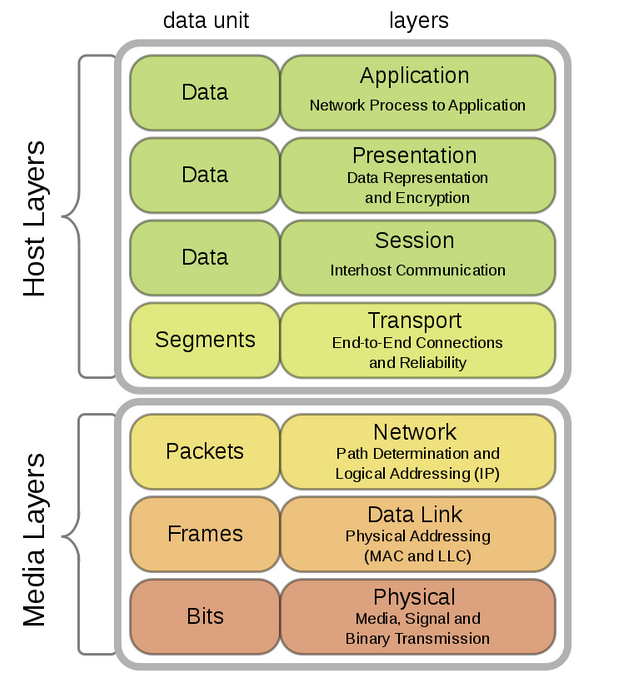
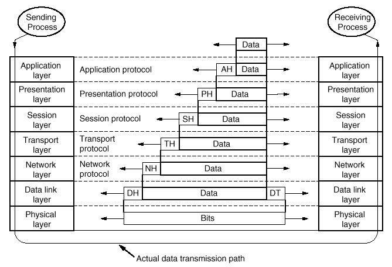

- OSI Model เป็นมาตฐานที่กำหนดโดย ISO แบ่งได้เป็น 7 ชั้นดังภาพ
  
	- version ปัจจุบันคือ ISO/IEC 7498-1:1994
	- มีรายละเอียดดังนี้
		- 1) Physical Layer (ชั้นทางกายภาพ): ชั้นนี้เกี่ยวกับข้อกำหนดทางกายภาพของการสื่อสาร เช่น สายสัญญาณ, การส่งข้อมูลในรูปแบบบิต (Bit) และการควบคุมการส่งข้อมูลผ่านสื่อสารต่าง ๆ เช่น เคเบิล, ฮับ
		- 2) Data Link Layer (ชั้นการเชื่อมต่อข้อมูล): ชั้นนี้รับผิดชั้นของการเชื่อมต่อข้อมูลระหว่างอุปกรณ์ในเครือข่าย การส่งข้อมูลในรูปแบบเฟรม (Frame)โดยจัดการกับการแก้ไขข้อผิดพลาดในการส่งข้อมูลและจัดการควบคุมการเข้าถึงสื่อสาร (Media Access Control)
		- 3) Network Layer (ชั้นเครือข่าย): ชั้นนี้รับผิดชั้นของการเส้นทางข้อมูลจากต้นทางไปยังปลายทาง การส่งข้อมูลในรูปแบบแพ็คเกท (Packets) และจัดการกับการเปลี่ยนเส้นทางข้อมูลผ่านเครือข่าย รวมถึงการจัดหาบริการเช่น เลือกเส้นทางและการสร้างซับเน็ตเวิร์ก.
		- 4) Transport Layer (ชั้นขนส่ง): ชั้นนี้รับผิดชั้นของการจัดการการส่งข้อมูลจากต้นทางไปยังปลายทาง การส่งข้อมูลในรูปแบบเซ็กเมนท์ (Segments) และควบคุมการสื่อสารระหว่างอุปกรณ์ทั้งสองด้วยการตรวจสอบข้อผิดพลาดและการควบคุมการส่งข้อมูล
		- 5) Session Layer (ชั้นเซสชัน): ชั้นนี้รับผิดชั้นของการจัดการเซสชันและการเชื่อมต่อระหว่างอุปกรณ์ที่ติดต่อกันในเครือข่าย การส่งข้อมูลในรูปแบบเดต้า (Data) เช่น การเปิดและปิดเซสชัน, การจัดการการเปลี่ยนระหว่างหน้าที่สื่อสาร, และการควบคุมการสื่อสาร
		- 6) Presentation Layer (ชั้นการนำเสนอ): ชั้นนี้รับผิดชั้นของการจัดรูปแบบข้อมูล แปลงข้อมูลให้อยู่ในรูปแบบที่สามารถอ่านและเข้าใจได้สำหรับอุปกรณ์ที่รับข้อมูล การส่งข้อมูลในรูปแบบเดต้า (Data) เช่น การเข้ารหัสและการถอดรหัสข้อมูล
		- 7) Application Layer (ชั้นแอปพลิเคชัน): ชั้นนี้เป็นชั้นบนสุดในระบบ OSI Model และรับผิดชั้นของแอปพลิเคชันและการสื่อสารในระดับสูง โดยรวมถึงการจัดการกับการสื่อสารระหว่างแอปพลิเคชันแต่ละอัน การส่งข้อมูลในรูปแบบเดต้า (Data) เช่น การส่งอีเมล, การเรียกเว็บไซต์, และการสื่อสารผ่านแอปพลิเคชันอื่น ๆ
- Data transmission characteristics
  
	- จะผ่านข้อมูลให้ชั้นที่มีลำดับติดกันเท่านั้น เช่นในการส่งข้อมูล จะผ่านจาก 7 6 5 ... 1 ในตอนรับจะผ่านข้อมูลจาก 1 2 3 ... 7
	- ในแต่ละชั้นจะมีการปรับปรุง Header ของ Data เช่นในการส่งข้อมูล ชั้น 7 จะเพิ่ม AH (Application Header) ส่วนการรับจะเป็นการทอด AH ออกให้เหลือแต่ Data
	- ในชั้น 2 นอกจากจะมี DH (Data link Header) แล้ว จะมี DT (Data link Tailer) ด้วย