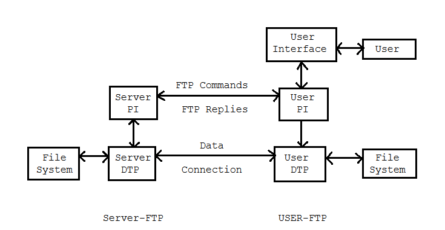

- HTTP (Hypertext Transfer Protocol)
	- พัฒนาโดย W3C และ IETF
	- versions:
	  | Version | Year introduced | Current status | RFC |
	  | HTTP/0.9 | 1991 | Obsolete | - |
	  | HTTP/1.0 | 1996 | Obsolete | RFC1945 |
	  | HTTP/1.1 | 1997 | Standard | RFC2616 |
	  | [HTTP/2](https://en.wikipedia.org/wiki/HTTP/2) | 2015 | Standard | RFC7540 |
	  | [HTTP/3](https://en.wikipedia.org/wiki/HTTP/3) | 2022 | Standard | RFC9114 |
	- หลักการทำงาน
	  
		- โปรโตคอล HTTP (Hypertext Transfer Protocol) ทำงานตามกระบวนการที่มีขั้นตอนพื้นฐานดังนี้:
			- 1. **การร้องขอ (Request)**:
				- เมื่อผู้ใช้ป้อน URL ในเว็บเบราว์เซอร์ เบราว์เซอร์จะสร้างคำขอ HTTP และส่งไปยังเซิร์ฟเวอร์ที่ระบุใน URL โดยใช้เมทอดการร้องขอ เช่น GET, POST, PUT, DELETE เป็นต้น.
			- 2. **การตอบรับ (Response)**:
				- เซิร์ฟเวอร์รับคำขอ HTTP และประมวลผลข้อมูลที่เกี่ยวข้องกับคำขอนั้น เช่น การเข้าถึงข้อมูลในฐานข้อมูลหรือการดึงไฟล์จากเครื่องเซิร์ฟเวอร์ จากนั้น เซิร์ฟเวอร์สร้างคำตอบ HTTP และส่งกลับไปยังเบราว์เซอร์ของผู้ใช้.
			- 3. **แบบสตรีม (Streaming)**:
				- ข้อมูลที่ส่งกลับจากเซิร์ฟเวอร์ถูกส่งเป็นแบบสตรีม (stream) ซึ่งหมายถึงการส่งข้อมูลเป็นชุดๆ หรือส่วนๆ ในรูปแบบของบายต์และเธรดไปยังเบราว์เซอร์ และเบราว์เซอร์จะแสดงข้อมูลที่รับมาทันที โดยไม่ต้องรอให้ข้อมูลทั้งหมดถูกส่งครบ.
			- 4. **แสดงผล (Rendering)**:
				- เมื่อข้อมูลถูกรับและแสดงผลบนเว็บเบราว์เซอร์ มันจะถูกแปลงเป็นเนื้อหาที่เราเห็นบนหน้าเว็บ เช่น ข้อความ, รูปภาพ, ลิงก์, และฟอร์ม ซึ่งแสดงผลให้ผู้ใช้สามารถโต้ตอบกับเว็บไซต์หรือแอปพลิเคชันได้.
			- 5. **การสิ้นสุดการเชื่อมต่อ (Connection Termination)**:
				- เมื่อข้อมูลถูกส่งไปยังเบราว์เซอร์แล้วและผู้ใช้ได้ดูข้อมูลหรือทำการตอบสนองกับเว็บไซต์ การเชื่อมต่อ HTTP สิ้นสุด และการเชื่อมต่อกับเซิร์ฟเวอร์จะถูกปิด.
		- ขั้นตอนเหล่านี้เป็นส่วนสำคัญของวิธีการทำงานของโปรโตคอล HTTP ซึ่งช่วยให้เว็บเบราว์เซอร์และเซิร์ฟเวอร์สื่อสารและแลกเปลี่ยนข้อมูลบนเว็บได้อย่างมีประสิทธิภาพและรวดเร็ว
- FTP (File Transfer Protocol)
	- เป็น Protocol สำหรับส่ง file ระหว่างเครื่อง 2 เครื่อง มีรายละเอียดดังนี้
	  
		- เครื่อง Server จะประกอบด้วย 2 ส่วนคือ
			- Control Process หรือ Protocol Interpreter (PI)
			- Data transfer protocol (DTP)
		- เครื่อง User จะประกอบด้วย 3 ส่วนคือ
			- Interface
			- Control Process หรือ Protocol Interpreter (PI)
			- Data transfer protocol (DTP)
	- กระบวนการส่งข้อมูลมีดังนี้
		- User ส่ง Request ไปยัง Client
		- Client จะติดต่อไปยัง server ด้วย Control Process
		- Server จะตอบรับการติดต่อ
		- User ทำการส่งข้อมูลได้ 3 รูปแบบคือ
			- ASCII สำหรับส่งข้อมูลประเภท plaintext
			- Binary สำหรับส่งข้อมูลที่ไม่ใช่ plaintext
			- EBCDIC สำหรับระบบที่ใช้ Character Encoding แบบ EBCDIC เท่านั้น เหมือน Binary
		- สามารถส่งข้อมูลได้ 3 modes
			- 1. **Stream Mode (Mode S)**: Mode S หมายถึง Stream Mode และเป็นโหมดการถ่ายโอนที่ไม่มีการแยกส่วนของข้อมูลด้วยตัวข้อมูลสัญลักษณ์หรือข้อความควบคุม ซึ่งหมายความว่าข้อมูลถูกส่งไปมาในรูปแบบแพ็คเก็ตหนึ่งชุดที่ไม่สามารถแยกแยะได้ และไม่มีการตรวจสอบและรวมการถ่ายโอนข้อมูล.
			- 2. **Block Mode (Mode B)**: Mode B หมายถึง Block Mode และเป็นโหมดการถ่ายโอนที่แยกแยะข้อมูลเป็นบล็อกหรือชุดข้อมูลที่มีขนาดคงที่ โดยใช้บล็อกข้อความควบคุมเพื่อระบุขนาดและจำนวนของบล็อก โหมดนี้มีการตรวจสอบความถูกต้องของข้อมูลและสามารถแก้ไขข้อผิดพลาดในการถ่ายโอนข้อมูล.
			- 3. **Compressed Mode (Mode C)**: Mode C หมายถึง Compressed Mode และเป็นโหมดการถ่ายโอนที่ใช้การบีบอัดข้อมูลเพื่อลดขนาดข้อมูลที่ถูกส่งไปยังเซิร์ฟเวอร์ FTP โหมดนี้อาจมีการใช้ซอฟต์แวร์บีบอัดและถอดรหัสข้อมูลเพื่อลดการใช้งานแบนด์วิดท์ของเครือข่าย.
- SMTP (Simple Mail Transfer Protocol) เป็นโปรโตคอลที่ใช้ในการส่งอีเมล (email) ระหว่างเครื่องคอมพิวเตอร์บนเครือข่ายอินเทอร์เน็ตหรือเครือข่ายภายในองค์กร โปรโตคอล SMTP มีบทบาทสำคัญในการส่งอีเมลจากผู้ส่งไปยังผู้รับ โดยทำหน้าที่เป็นตัวกลางในการส่งข้อมูลอีเมลให้ถูกตำแหน่งผู้รับ.
- นี่คือวิธีการทำงานของ SMTP:
	- 1) การเชื่อมต่อ: เครื่องคอมพิวเตอร์ที่สร้างข้อความอีเมล (ผู้ส่ง) จะเชื่อมต่อกับเซิร์ฟเวอร์ SMTP ของผู้ให้บริการอีเมลหรือเซิร์ฟเวอร์ SMTP ภายในองค์กร.
	- 2) การส่งข้อมูล: ข้อความอีเมลถูกสร้างขึ้นและถูกส่งไปยังเซิร์ฟเวอร์ SMTP ผ่านการเชื่อมต่อ.
	- 3) การกำหนดผู้รับ: ผู้ส่งระบุที่อยู่อีเมลของผู้รับในข้อความอีเมล โดยใช้ที่อยู่อีเมล (email address) ของผู้รับ.
	- 4) การตรวจสอบเส้นทาง: เซิร์ฟเวอร์ SMTP จะตรวจสอบเส้นทางการส่งข้อความไปยังเซิร์ฟเวอร์ SMTP ของผู้รับโดยใช้ข้อมูลในที่อยู่อีเมลของผู้รับ (domain) และทำการค้นหาเซิร์ฟเวอร์ SMTP ของผู้รับ (MX record lookup).
	- 5) การส่งข้อมูล: เซิร์ฟเวอร์ SMTP ของผู้ส่งจะเปิดการเชื่อมต่อกับเซิร์ฟเวอร์ SMTP ของผู้รับและส่งข้อความอีเมลไปยังเซิร์ฟเวอร์ SMTP ของผู้รับ.
	- 6) การรับรองการส่ง: เซิร์ฟเวอร์ SMTP ของผู้รับจะตรวจสอบว่าข้อความถูกส่งไปถึงเซิร์ฟเวอร์ SMTP ของผู้รับอย่างถูกต้อง และส่งการยืนยันการส่งกลับไปยังเซิร์ฟเวอร์ SMTP ของผู้ส่ง.
	- 7) การจัดส่งให้ผู้รับ: เซิร์ฟเวอร์ SMTP ของผู้รับจะนำข้อความอีเมลมาเก็บไว้ในกล่องจดหมายของผู้รับหรือระบบอีเมลของผู้รับ ซึ่งผู้รับสามารถเข้าถึงได้เมื่อต้องการ.
- POP (Post Office Protocol) เป็นโปรโตคอลที่ใช้ในการรับอีเมล (email) จากเซิร์ฟเวอร์อีเมล โดยทำหน้าที่เป็นตัวควบคุมในการดาวน์โหลดข้อความอีเมลจากเซิร์ฟเวอร์เข้าสู่คอมพิวเตอร์หรืออุปกรณ์อีเมลของผู้ใช้
	- นี่คือวิธีการทำงานของ POP:
		- 1. **การเชื่อมต่อกับเซิร์ฟเวอร์ POP**: ผู้ใช้เปิดโปรแกรมอีเมล (อีเมลไคลเอนต์) บนคอมพิวเตอร์หรืออุปกรณ์อื่น ๆ และกำหนดการเชื่อมต่อกับเซิร์ฟเวอร์ POP ของผู้ให้บริการอีเมล โปรแกรมอีเมลจะต้องระบุที่อยู่เซิร์ฟเวอร์ POP, พอร์ต POP (มักเป็นพอร์ต 110), ชื่อผู้ใช้ (username), และรหัสผ่าน (password) เพื่อเข้าสู่ระบบเซิร์ฟเวอร์ POP.
		- 2. **การดาวน์โหลดอีเมล**: เมื่อโปรแกรมอีเมลเชื่อมต่อกับเซิร์ฟเวอร์ POP แล้ว จะเริ่มดาวน์โหลดข้อความอีเมลจากเซิร์ฟเวอร์ POP ลงสู่คอมพิวเตอร์หรืออุปกรณ์ของผู้ใช้ ข้อความอีเมลถูกดาวน์โหลดลงบนเครื่องของผู้ใช้และบันทึกในกล่องจดหมายของโปรแกรมอีเมล.
		- 3. **การเก็บข้อความอีเมล**: เมื่อข้อความอีเมลถูกดาวน์โหลดและบันทึกลงในคอมพิวเตอร์หรืออุปกรณ์ของผู้ใช้ โปรแกรมอีเมลจะเริ่มเก็บข้อความอีเมลบนเครื่องนั้น ข้อความจะถูกเก็บไว้ในรูปแบบของไฟล์ข้อความที่ผู้ใช้สามารถอ่านและจัดการได้.
		- 4. **การลบข้อความจากเซิร์ฟเวอร์**: โปรแกรมอีเมลจะมีตัวเลือกให้ผู้ใช้เลือกว่าจะลบข้อความอีเมลจากเซิร์ฟเวอร์ POP หลังจากการดาวน์โหลดเสร็จสิ้นหรือไม่ ผู้ใช้สามารถตั้งค่าให้เซิร์ฟเวอร์ POP ไม่เก็บข้อความหรือเก็บไว้เฉพาะบนเครื่องของผู้ใช้.
		- 5. **การจัดเก็บข้อความ**: ข้อความอีเมลที่ถูกดาวน์โหลดและบันทึกลงในคอมพิวเตอร์หรืออุปกรณ์ของผู้ใช้จะถูกจัดเก็บในโครงสร้างของโฟลเดอร์และกล่องจดหมายของโปรแกรมอีเมล.
		- 6. **การจัดการอีเมล**: ผู้ใช้สามารถอ่าน, ลบ, ตอบ, ส่ง, หรือจัดการข้อความอีเมลในโปรแกรมอีเมลตามความต้องการ.
	- POP มีหลายรุ่นและมีความเผื่อในการทำงานร่วมกับโปรแกรมอีเมลต่าง ๆ โดยมักใช้เป็นโปรโตคอลการรับอีเมลที่ไม่รู้จักการจัดการอีเมลบนเซิร์ฟเวอร์ (แบบแพร่) แต่ส่วนใหญ่ใช้แบบ "POP3" ซึ่งจะดาวน์โหลดอีเมลล์จากเซิร์ฟเวอร์และเก็บไว้ที่เครื่องของผู้ใช้ โปรแกรมอีเมลอื่น ๆ เช่น Outlook, Thunderbird, และ Apple Mail สามารถใช้ POP3 เพื่อรับอีเมลจากเซิร์ฟเวอร์อีเมล.
- IMAP (Internet Message Access Protocol) เป็นโปรโตคอลสำหรับการรับอีเมล (email) ที่มีความสามารถในการจัดการอีเมลและเข้าถึงอีเมลจากเซิร์ฟเวอร์อีเมลในโหมดแบบใช้งานร่วมกันระหว่างหลายอุปกรณ์ โดย IMAP อนุญาตให้ผู้ใช้เข้าถึงอีเมลและโฟลเดอร์อีเมลบนเซิร์ฟเวอร์แบบเรียลไทม์ (real-time) และใช้งานอีเมลได้ร่วมกันระหว่างหลายอุปกรณ์โดยที่ข้อมูลจะเหมือนกันทุกที่
	- นี่คือวิธีการทำงานของ IMAP:
		- 1. **การเชื่อมต่อกับเซิร์ฟเวอร์ IMAP**: เมื่อผู้ใช้เปิดโปรแกรมอีเมล (อีเมลไคลเอนต์) บนคอมพิวเตอร์หรืออุปกรณ์อื่น ๆ และกำหนดการเชื่อมต่อกับเซิร์ฟเวอร์ IMAP ของผู้ให้บริการอีเมล โปรแกรมอีเมลจะต้องระบุที่อยู่เซิร์ฟเวอร์ IMAP, พอร์ต IMAP (มักเป็นพอร์ต 143 หรือ 993 สำหรับ SSL/TLS ที่เข้ารหัสข้อมูล), ชื่อผู้ใช้ (username), และรหัสผ่าน (password) เพื่อเข้าสู่ระบบเซิร์ฟเวอร์ IMAP.
		- 2. **การเรียกดูโครงสร้างของอีเมล**: เมื่อโปรแกรมอีเมลเชื่อมต่อกับเซิร์ฟเวอร์ IMAP แล้ว จะมีการเรียกดูโครงสร้างของอีเมลบนเซิร์ฟเวอร์ ซึ่งรวมถึงรายชื่อของโฟลเดอร์อีเมลและจำนวนข้อความในแต่ละโฟลเดอร์ ผู้ใช้สามารถเลือกโฟลเดอร์ที่ต้องการดูและเรียกดูรายละเอียดของข้อความอีเมลภายในโฟลเดอร์นั้น.
		- 3. **การอ่านและจัดการอีเมล**: ผู้ใช้สามารถอ่านและจัดการข้อความอีเมลที่อยู่บนเซิร์ฟเวอร์ IMAP โดยการกดคลิกที่ข้อความเพื่อเปิด, ลบ, ส่งตอบ, หรือเลื่อนข้อความไปยังโฟลเดอร์อื่น ๆ ในโปรแกรมอีเมล การเปลี่ยนแปลงนี้จะถูกสะท้อนกลับไปยังเซิร์ฟเวอร์ IMAP ซึ่งทำให้ข้อมูลอีเมลของผู้ใช้มีความเหมือนกันทุกที่.
		- 4. **การเก็บข้อความบนเซิร์ฟเวอร์**: ข้อความอีเมลไม่ถูกดาวน์โหลดลงเครื่องของผู้ใช้ แต่จะถูกเก็บไว้บนเซิร์ฟเวอร์ IMAP โปรแกรมอีเมลเปิดดาวน์โหลดและแสดงข้อความอีเมลที่เซิร์ฟเวอร์ IMAP ให้ผู้ใช้เห็น ข้อมูลอยู่บนเซิร์ฟเวอร์ดังนั้นสามารถเข้าถึงได้จากอุปกรณ์และที่ทำงานแตกต่าง ๆ.
		- 5. **การเปิดดาวน์โหลดข้อความ**: ผู้ใช้สามารถเลือกที่จะดาวน์โหลดข้อความอีเมลไปยังเครื่องของตนเมื่อต้องการ การดาวน์โหลดจะเป็นการคัดลอกข้อความไปยังเครื่องของผู้ใช้และให้ผู้ใช้ทำการจัดเก็บและจัดการกับข้อความได้โดยอิสระ.
	- IMAP มีประโยชน์ในกรณีที่ผู้ใช้ต้องการเข้าถึงอีเมลจากหลายอุปกรณ์หรือต้องการรับอีเมลแบบเรียลไทม์ โดย IMAP ข้อมูลอีเมลจะถูกเก็บอยู่บนเซิร์ฟเวอร์และผู้ใช้สามารถเข้าถึงและจัดการอีเมลจากทุกที่ โดยไม่ต้องรับข้อมูลซ้ำเมื่อใช้หลายอุปกรณ์หรือโปรแกรมอีเมลต่าง ๆ และไม่จำเป็นต้องดาวน์โหลดข้อความทั้งหมดลงเครื่องของผู้ใช้.