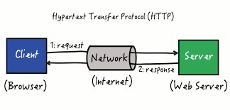

- HTTP
	- พัฒนาโดย W3C และ IETF
	- versions:
	  | Version | Year introduced | Current status | RFC |
	  | HTTP/0.9 | 1991 | Obsolete | - |
	  | HTTP/1.0 | 1996 | Obsolete | RFC1945 |
	  | HTTP/1.1 | 1997 | Standard | RFC2616 |
	  | [HTTP/2](https://en.wikipedia.org/wiki/HTTP/2) | 2015 | Standard | RFC7540 |
	  | [HTTP/3](https://en.wikipedia.org/wiki/HTTP/3) | 2022 | Standard | RFC9114 |
	- หลักการทำงาน
	  
		- โปรโตคอล HTTP (Hypertext Transfer Protocol) ทำงานตามกระบวนการที่มีขั้นตอนพื้นฐานดังนี้:
			- 1. **การร้องขอ (Request)**:
				- เมื่อผู้ใช้ป้อน URL ในเว็บเบราว์เซอร์ เบราว์เซอร์จะสร้างคำขอ HTTP และส่งไปยังเซิร์ฟเวอร์ที่ระบุใน URL โดยใช้เมทอดการร้องขอ เช่น GET, POST, PUT, DELETE เป็นต้น.
			- 2. **การตอบรับ (Response)**:
				- เซิร์ฟเวอร์รับคำขอ HTTP และประมวลผลข้อมูลที่เกี่ยวข้องกับคำขอนั้น เช่น การเข้าถึงข้อมูลในฐานข้อมูลหรือการดึงไฟล์จากเครื่องเซิร์ฟเวอร์ จากนั้น เซิร์ฟเวอร์สร้างคำตอบ HTTP และส่งกลับไปยังเบราว์เซอร์ของผู้ใช้.
			- 3. **แบบสตรีม (Streaming)**:
				- ข้อมูลที่ส่งกลับจากเซิร์ฟเวอร์ถูกส่งเป็นแบบสตรีม (stream) ซึ่งหมายถึงการส่งข้อมูลเป็นชุดๆ หรือส่วนๆ ในรูปแบบของบายต์และเธรดไปยังเบราว์เซอร์ และเบราว์เซอร์จะแสดงข้อมูลที่รับมาทันที โดยไม่ต้องรอให้ข้อมูลทั้งหมดถูกส่งครบ.
			- 4. **แสดงผล (Rendering)**:
				- เมื่อข้อมูลถูกรับและแสดงผลบนเว็บเบราว์เซอร์ มันจะถูกแปลงเป็นเนื้อหาที่เราเห็นบนหน้าเว็บ เช่น ข้อความ, รูปภาพ, ลิงก์, และฟอร์ม ซึ่งแสดงผลให้ผู้ใช้สามารถโต้ตอบกับเว็บไซต์หรือแอปพลิเคชันได้.
			- 5. **การสิ้นสุดการเชื่อมต่อ (Connection Termination)**:
				- เมื่อข้อมูลถูกส่งไปยังเบราว์เซอร์แล้วและผู้ใช้ได้ดูข้อมูลหรือทำการตอบสนองกับเว็บไซต์ การเชื่อมต่อ HTTP สิ้นสุด และการเชื่อมต่อกับเซิร์ฟเวอร์จะถูกปิด.
		- ขั้นตอนเหล่านี้เป็นส่วนสำคัญของวิธีการทำงานของโปรโตคอล HTTP ซึ่งช่วยให้เว็บเบราว์เซอร์และเซิร์ฟเวอร์สื่อสารและแลกเปลี่ยนข้อมูลบนเว็บได้อย่างมีประสิทธิภาพและรวดเร็ว
- FTP
	- เป็น Protocol สำหรับส่ง file ระหว่างเครื่อง 2 เครื่อง มีรายละเอียดดังนี้
	  
		- เครื่อง Server จะประกอบด้วย 2 ส่วนคือ
			- Control Process หรือ Protocol Interpreter (PI)
			- Data transfer protocol (DTP)
		- เครื่อง User จะประกอบด้วย 3 ส่วนคือ
			- Interface
			- Control Process หรือ Protocol Interpreter (PI)
			- Data transfer protocol (DTP)
	- กระบวนการส่งข้อมูลมีดังนี้
		- User ส่ง Request ไปยัง Client
		- Client จะติดต่อไปยัง server ด้วย Control Process
		- Server จะตอบรับการติดต่อ
		- User ทำการส่งข้อมูลได้ 3 รูปแบบคือ
			- ASCII สำหรับส่งข้อมูลประเภท plaintext
			- Binary สำหรับส่งข้อมูลที่ไม่ใช่ plaintext
			- EBCDIC สำหรับระบบที่ใช้ Character Encoding แบบ EBCDIC เท่านั้น เหมือน Binary
		- สามารถส่งข้อมูลได้ 3 modes
			- 1. **Stream Mode (Mode S)**: Mode S หมายถึง Stream Mode และเป็นโหมดการถ่ายโอนที่ไม่มีการแยกส่วนของข้อมูลด้วยตัวข้อมูลสัญลักษณ์หรือข้อความควบคุม ซึ่งหมายความว่าข้อมูลถูกส่งไปมาในรูปแบบแพ็คเก็ตหนึ่งชุดที่ไม่สามารถแยกแยะได้ และไม่มีการตรวจสอบและรวมการถ่ายโอนข้อมูล.
			- 2. **Block Mode (Mode B)**: Mode B หมายถึง Block Mode และเป็นโหมดการถ่ายโอนที่แยกแยะข้อมูลเป็นบล็อกหรือชุดข้อมูลที่มีขนาดคงที่ โดยใช้บล็อกข้อความควบคุมเพื่อระบุขนาดและจำนวนของบล็อก โหมดนี้มีการตรวจสอบความถูกต้องของข้อมูลและสามารถแก้ไขข้อผิดพลาดในการถ่ายโอนข้อมูล.
			  3. **Compressed Mode (Mode C)**: Mode C หมายถึง Compressed Mode และเป็นโหมดการถ่ายโอนที่ใช้การบีบอัดข้อมูลเพื่อลดขนาดข้อมูลที่ถูกส่งไปยังเซิร์ฟเวอร์ FTP โหมดนี้อาจมีการใช้ซอฟต์แวร์บีบอัดและถอดรหัสข้อมูลเพื่อลดการใช้งานแบนด์วิดท์ของเครือข่าย.
		-