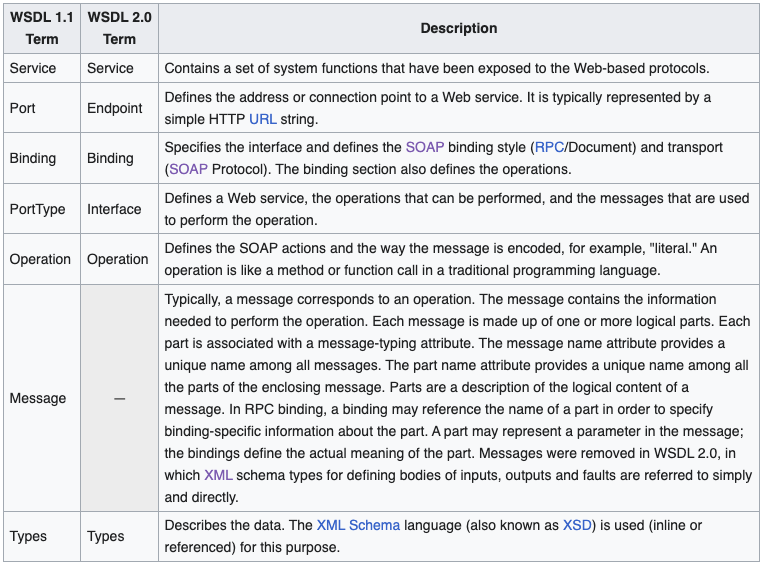

- WSDL 1.1 (Web Services Description Language) และ WSDL 2.0 (Web Services Description Language Version 2.0) คือสองเวอร์ชันของภาษาในการอธิบายเว็บเซอร์วิส แต่มีความแตกต่างกันในหลายด้าน:
	- 1. **ความซับซ้อนของภาษา:**
		- WSDL 1.1: WSDL 1.1 มีโครงสร้างและฟีเจอร์ที่ส่วนมากจำกัด เราสามารถใช้ XML Schema (XSD) เพื่อระบุโครงสร้างข้อมูลที่ส่งไป-รับกลับ.
		- WSDL 2.0: WSDL 2.0 ถูกออกแบบให้มีความยืดหยุ่นมากขึ้น มีรูปแบบของโครงสร้างที่ใช้งานได้กว้างขึ้นและรองรับการอธิบายเว็บเซอร์วิสที่มีความซับซ้อนมากขึ้น.
	- 2. **การรองรับแนวคิดของเซอร์วิส:**
		- WSDL 1.1: WSDL 1.1 มีส่วนของเซอร์วิสที่สนับสนุนการสร้างเว็บเซอร์วิสเบื้องต้น (document-style) และการสร้างเว็บเซอร์วิสแบบรายการ (rpc-style). การสนับสนุนแนวคิดของข้อความแบบอัตโนมัติ (automatic SOAP) ยังไม่สมบูรณ์.
		- WSDL 2.0: WSDL 2.0 มีการรองรับแนวคิดของเว็บเซอร์วิสในรูปแบบที่มีความยืดหยุ่นมากขึ้น และสนับสนุนการสร้างเว็บเซอร์วิสแบบรายการ (rpc-style) อย่างครอบคลุม.
	- 3. **การใช้งาน namespace:**
		- WSDL 1.1: ใช้ namespace `http://schemas.xmlsoap.org/wsdl/` สำหรับอิลิเมนต์หลักของ WSDL 1.1.
		- WSDL 2.0: ใช้ namespace `http://www.w3.org/ns/wsdl` สำหรับอิลิเมนต์หลักของ WSDL 2.0.
	- 4. **การรองรับคุณลักษณะ (Attributes):**
		- WSDL 1.1: WSDL 1.1 มีคุณลักษณะเพียงไม่กี่รายการเช่น `name`, `targetNamespace`, `type`, และอื่น ๆ.
		- WSDL 2.0: WSDL 2.0 มีคุณลักษณะมากมายที่ช่วยให้ระบุและกำหนดคุณลักษณะของเว็บเซอร์วิสได้แม่นยำขึ้น.
	- 5. **การรองรับแนวคิดและสคีม่าที่มีความซับซ้อน:**
		- WSDL 1.1: มีข้อจำกัดในการอธิบายเว็บเซอร์วิสที่มีความซับซ้อนและแนวคิดที่ไม่ได้รองรับอย่างครอบคลุม เช่น การอธิบายเว็บเซอร์วิสที่ใช้เมทอดซ้อนๆ กัน.
		- WSDL 2.0: ออกแบบมาเพื่อรองรับแนวคิดและสคีม่าที่มีความซับซ้อนมากขึ้น และให้ความยืดหยุ่นในการกำหนดข้อมูลและสคีม่า.
	- 6. **การใช้งาน SOAP:**
		- WSDL 1.1: มีการรองรับ SOAP อย่างมีจำกัด และต้องใช้การกำหนดคุณลักษณะเพิ่มเติมสำหรับการใช้งาน SOAP.
		- WSDL 2.0: มีการรองรับ SOAP อย่างครอบคลุมมากขึ้นและช่วยในการกำหนดรูปแบบของข้อมูลที่ส่งผ่าน SOAP ได้อย่างแม่นยำ.
	- 7. **การใช้งาน RESTful:**
		- WSDL 1.1: ไม่มีการรองรับ RESTful services โดยตรง.
		- WSDL 2.0: มีการรองรับ RESTful services อย่างมีจำนวนมากขึ้นและช่วยในการกำหนดเว็บเซอร์วิสแบบ RESTful.
	- 8. **การอธิบายการจัดการข้อผิดพลาด:**
		- WSDL 1.1: มีข้อจำกัดในการอธิบายการจัดการข้อผิดพลาดในเว็บเซอร์วิส.
		- WSDL 2.0: มีรูปแบบและคุณลักษณะที่ช่วยในการอธิบายการจัดการข้อผิดพลาดในเว็บเซอร์วิส.
- การเลือกใช้ WSDL 1.1 หรือ WSDL 2.0 ขึ้นอยู่กับความต้องการและความซับซ้อนของโครงการของคุณ แต่ WSDL 2.0 มีความยืดหยุ่นและรองรับความซับซ้อนมากขึ้น ทำให้เหมาะสำหรับโครงการที่มีความซับซ้อนและความยืดหยุ่นในการอธิบายเว็บเซอร์วิส.
- 