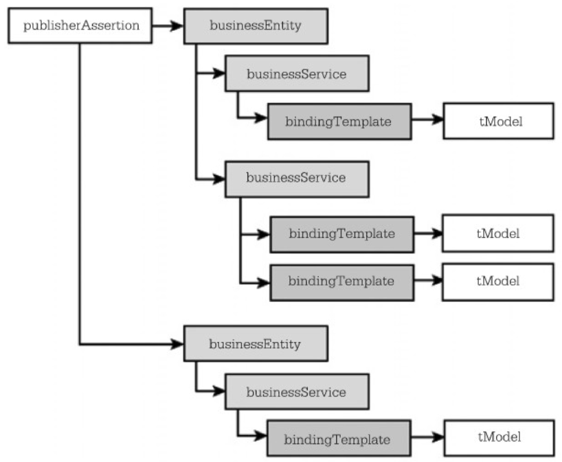

- UDDI Element มี 5 element เรียงตามโครงสร้าง ดังนี้:
  
	- publisherAssertion (ส่วนที่ 1)
		- businessEntity (ส่วนที่ 2)
			- businessService (ส่วนที่ 2)
				- bindingTemplate (ส่วนที่ 2)
					- tModel (ส่วนที่ 3)
	- แต่ละส่วนมีหน้าที่ดังนี้
		- ส่วนที่ 1 กำหนดความสัมพันธ์ของ ส่วนที่ 2
			- publisherAssertion
		- ส่วนที่ 2 แสดงรายละเอียดว่าสามารถเรียกใช้บริการอะไรได้บ้าง
			- businessEntity แยกได้ 3 กลุ่มย่อยตามรายละเอียด
				- White Page ประกอบด้วยข้อมูลที่ใช้ในการะบุตัวตนของผู้ใช้บริการ
				- Yellow Page รายละเอียดว่ามีบริการอะไรให้ใช้บ้าง
				- Green Page วิธีใช้งานบริการ
			- businessService
			- bindingTemplate
				- element `accessPoint` จะเป็นตัวกำหนดวิธีการ Binding ว่าจะใช้วิธีใด `SOAP`, `HTTP`, `SMTP`
		- ส่วนที่ 3 กำหนดรายละเอียดทางเทคนิกเพื่อให้ผู้ขอใช้บริการนำไปพัฒนา Application
			- tModel
	- ในมาตรฐาน UDDI version 3.0 (Universal Description, Discovery, and Integration), มีหมวดหมู่และระบบรหัสที่ช่วยในการจัดหมวดหมู่และค้นหาบริการเว็บและธุรกิจ 3 ระบบหลักคือ:
		- NAICS (North American Industry Classification System):
			- NAICS เป็นระบบหมวดหมู่ธุรกิจที่ใช้ในการจัดหมวดหมู่และระบุธุรกิจตามกลุ่มและสาขาของธุรกิจ สำหรับ UDDI, NAICS สามารถใช้เพื่อระบุประเภทหรือกลุ่มของบริการเว็บที่ธุรกิจนำเสนอ.
		- UNSPSC (United Nations Standard Products and Services Code):
			- UNSPSC เป็นระบบรหัสที่ใช้ในการจัดหมวดหมู่สินค้าและบริการตามรูปแบบที่มีให้ สำหรับ UDDI, UNSPSC สามารถใช้ในการระบุบริการเว็บหรือธุรกิจที่ให้บริการตามรหัส UNSPSC.
		- ISO 3166 (International Organization for Standardization Country Codes):
			- ISO 3166 เป็นระบบรหัสประเทศที่ใช้ในการระบุประเทศและรหัสทางธุรกิจที่เกี่ยวข้องกับแต่ละประเทศ สำหรับ UDDI, ISO 3166 สามารถใช้ในการระบุประเทศที่ธุรกิจหรือบริการเว็บเกี่ยวข้อง.
	- การใช้ระบบรหัสและหมวดหมู่เหล่านี้ใน UDDI ช่วยในการจัดหมวดหมู่และค้นหาบริการเว็บหรือธุรกิจที่ตรงกับความต้องการของผู้ใช้ในเชิงทางธุรกิจและสินค้าหรือบริการที่พวกเขากำลังค้นหา.