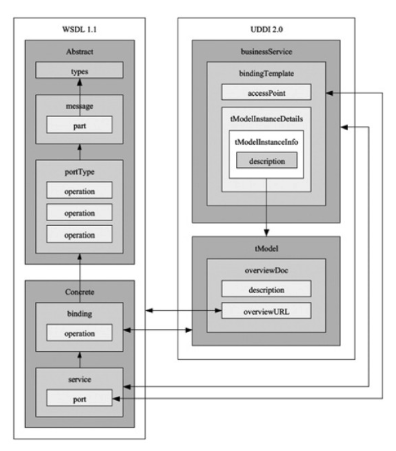

- 
  ความสัมพันธ์ระหว่าง WSDL1.1 และ UDDI2.0 มีรายละเอียดดังนี้
	- element `service` ใน wsdl = element `businessService` ใน uddi
	- element `port` ใน wsdl = element `bindingTemplate` ใน uddi
	- element `biding` ใน wsdl = element `tModel` ใน uddi
	- ที่อยู่ของเอกสาร wsdl อ้างอิงจาก element overviewURL ใน uddi
	- ความสัมพันธ์ภายในของ UDDI ระหว่าง businessService และ tModel
		- จากตัวอย่างนี้
		  ```xml
		  <tModel tModelKey="uuid:7B581129-7926-5202-AB17-74A234F21BA5">
		  	<name>Purchase order submission service</name>
		  	<description xml:lang="en">Interface for purchase order submission service</description>
		  	<overviewDoc>
		  		<description xml:lang="en">Reference to the WSDLdocument that contains the definition </description>
		  		<overviewURL>
		  http://www.skatestown.com/services/poSubmissionInterface.wsdl
		  </overviewURL>
		  	</overviewDoc>
		  	<identifierBag>
		  		<keyReference keyName="DUNS" keyValue="00-111-1111"
		   tModelKey="uuid:7283F314-8373-AD52-891A-CD267826FA48"/>
		  	</identifierBag>
		  	<categoryBag>
		  		<keyReference keyName="uddi-org:types" keyValue="soapSpec"
		   tModelKey="uuid:5483F314-8373-AD52-891A-CD267826FA48"/>
		  		<keyReference keyName="uddi-org:types" keyValue="wsdlSpec"
		   tModelKey="uuid:5483F314-8373-AD52-891A-CD267826FA48"/>
		  		<keyReference keyName="Sport equipment and accessories"
		   keyValue="49221500"
		   tModelKey="uuid:54245F21-8373-AD32-8911-3226HAC76833"/>
		  	</categoryBag>
		  </tModel> 
		  ```
			- `tModelKey` = UUID ของ tModel
			- `<description>...</description>` อธิบายรายละเอียดของ tModel
			- `<overviewURL>...</overviewURL>` url ปลายทางของเอกสารที่อธิบายรายละเอียดของ Service
			- `<keyReference>...</keyReference>` ใน `keyValue` จะกำกับรูปแบบเพื่อให้ program เข้าใจว่า `overviewURL` ชี้ไปที่เอกสารประเภทใด ตามตัวอย่างคือ wsdl
		- จากตัวอย่างนี้
		  ```xml
		  <businessServices>
		  	<businessService serviceKey="4C379407-3B1B-DC97-B1C7-F68597DA4ADB" businessKey="55BB30D8-565A-4BF9-BA2B-83118ABD644D">
		  		<name>Purchase Order Submission</name>
		  		<description>SkatesTown purchase order submission service.</description>
		  		<bindingTemplates>
		  			<bindingTemplate bindingKey="26BAE12-04E3-DBC2-90DB-A96E21406F79" serviceKey="4C379407-3E1B-DC97-B1C7-F68597DA4ADB">
		  				<description>Web based (HTTP) purchase order submission service.</description>
		  				<accessPoint URIType="http">http://www.skatestown.com/services/poSubmission.html</accessPoint>
		  				<tModelInstanceDetails>
		  					<tModelInstanceInfo tModelKey="uuid:68DE9E80-AD09-469D-8A37-088422BFBC36D">
		  						<description>HTTP address</description>
		  					</tModelInstanceInfo>
		  				</tModelInstanceDetails>
		  			</bindingTemplate>
		  			<bindingTemplate bindingKey="3F7ABC88-14F2-AEF2-41AE-F86E52908A11" serviceKey="4C379407-31B-DC97-B1C7-F68597DA4ADB">
		  				<description>SOAP based purchase order submission service.</description>
		  				<accessPoint URLType="http">http://www.skatestown.com/services/poSubmission</accessPoint>
		  				<tModelInstanceDetails>
		  					<tModelInstanceInfo tModelKey="uuid:78581129-7926-5202-AB17-74A234F21BA5">
		  						<description>Reference to tModel Web service interface definition </description>
		  					</tModelInstanceInfo>
		  				</tModelInstanceDetails>
		  			</bindingTemplate>
		  		</bindingTemplates>
		  		<categoryBag>
		  			<keyedReference keyName="Sports equipment and accessories" keyValue="49221500" tModelKey="uuid:CD153257-086A-4237-B336-6BDCBDCC6634"/>
		  		</categoryBag>
		  	</businessService>
		  </businessServices>
		  ```
			- element `name` = `Purchase Order Submission` เป็นชื่อของ service นี้
			- element `description` บรรยายรายละเอียดของ service
			- `bindingTemplate` line 6 - 24 มี `accessPoint` สำหรับใช้เรียก Web Service
			- `tModelInstanceInfo` refer ถึง tModel ด้วย tModelkey